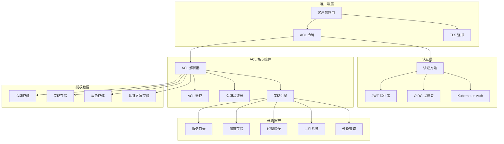
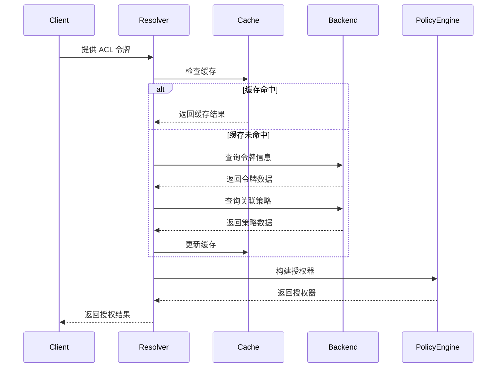
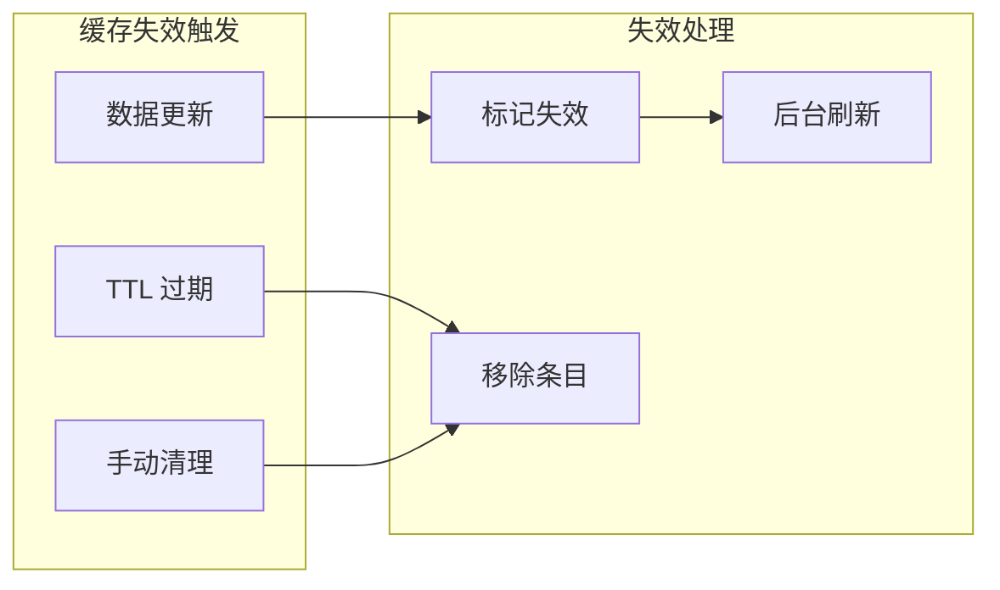
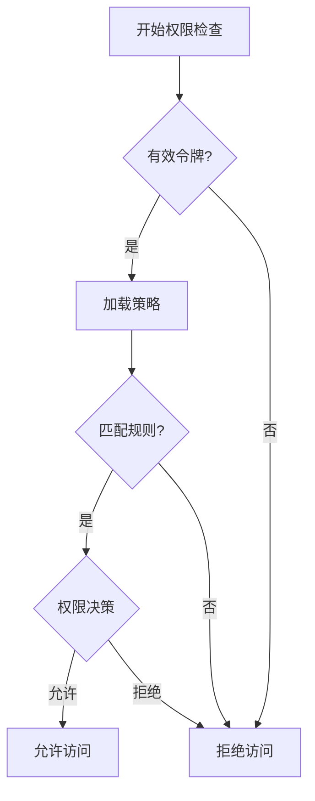

# Consul ACL 安全架构

## 概述

Consul 的访问控制列表 (ACL) 系统提供了细粒度的安全控制，支持基于令牌的身份验证和授权。ACL 系统采用默认拒绝的安全模型，确保只有经过授权的操作才能执行。

## ACL 架构总览



## 1. ACL 核心组件

### 1.1 ACL 解析器 (ACLResolver)

#### 核心实现
- **位置**: `agent/consul/acl.go:252-267`
- **功能**: 处理所有令牌和策略解析需求

```go
// ACLResolver 是处理所有令牌和策略解析需求的类型
type ACLResolver struct {
    config *ACLResolverConfig
    logger hclog.Logger
    
    // 缓存组件
    cache *ACLCache
    
    // 后端存储
    backend ACLResolverBackend
    
    // 认证方法验证器
    authMethodValidators authmethod.Cache
}
```

#### 解析流程


### 1.2 策略引擎

#### 策略结构
```go
// 位置: acl/policy.go
type Policy struct {
    ID          string
    Name        string
    Description string
    Rules       string
    Syntax      SyntaxVersion
    Datacenters []string
    Hash        []byte
    CreateIndex uint64
    ModifyIndex uint64
    
    // 企业版字段
    EnterprisePolicyMeta
}
```

#### 策略规则语法
```hcl
# 节点策略
node_prefix "" {
  policy = "read"
}

node "web-server" {
  policy = "write"
}

# 服务策略
service_prefix "" {
  policy = "read"
}

service "web" {
  policy = "write"
}

# 键值策略
key_prefix "" {
  policy = "read"
}

key "config/" {
  policy = "write"
}

# 代理策略
agent_prefix "" {
  policy = "read"
}

agent "web-server" {
  policy = "write"
}

# 事件策略
event_prefix "" {
  policy = "read"
}

event "deploy" {
  policy = "write"
}

# 预备查询策略
query_prefix "" {
  policy = "read"
}

query "web-query" {
  policy = "write"
}
```

### 1.3 令牌管理

#### 令牌类型
```go
type TokenType string

const (
    TokenTypeClient     TokenType = "client"
    TokenTypeManagement TokenType = "management"
)
```

#### 令牌结构
```go
type Token struct {
    AccessorID      string
    SecretID        string
    Description     string
    Policies        []PolicyLink
    Roles           []RoleLink
    ServiceIdentities []ServiceIdentity
    NodeIdentities    []NodeIdentity
    Local           bool
    AuthMethod      string
    ExpirationTime  *time.Time
    CreateTime      time.Time
    Hash            []byte
    CreateIndex     uint64
    ModifyIndex     uint64
    
    // 企业版字段
    EnterpriseMeta
}
```

## 2. 认证方法

### 2.1 JWT 认证

#### JWT 提供者配置
```json
{
  "Kind": "jwt-provider",
  "Name": "okta",
  "JSONWebKeySet": {
    "Remote": {
      "URI": "https://dev-123456.okta.com/oauth2/default/v1/keys",
      "RequestTimeoutMs": 1000,
      "CacheDurationMs": 300000
    }
  },
  "Issuer": "https://dev-123456.okta.com/oauth2/default",
  "Audiences": ["api://default"]
}
```

#### JWT 认证方法
```json
{
  "Kind": "auth-method",
  "Name": "jwt-okta",
  "Type": "jwt",
  "Config": {
    "JWTProvider": "okta",
    "ClaimMappings": {
      "sub": "user_id",
      "email": "email"
    },
    "BoundAudiences": ["api://default"]
  }
}
```

### 2.2 Kubernetes 认证

#### K8s 认证方法配置
```json
{
  "Kind": "auth-method",
  "Name": "k8s-auth",
  "Type": "kubernetes",
  "Config": {
    "Host": "https://kubernetes.default.svc.cluster.local:443",
    "CACert": "-----BEGIN CERTIFICATE-----\n...",
    "ServiceAccountJWT": "eyJhbGciOiJSUzI1NiIs..."
  }
}
```

### 2.3 OIDC 认证

#### OIDC 配置
```json
{
  "Kind": "auth-method",
  "Name": "oidc-auth",
  "Type": "oidc",
  "Config": {
    "OIDCDiscoveryURL": "https://auth.example.com/.well-known/openid_configuration",
    "OIDCClientID": "consul-client-id",
    "OIDCClientSecret": "consul-client-secret",
    "BoundAudiences": ["consul"],
    "AllowedRedirectURIs": ["http://localhost:8550/oidc/callback"]
  }
}
```

## 3. 角色和服务身份

### 3.1 角色管理

#### 角色结构
```go
type Role struct {
    ID              string
    Name            string
    Description     string
    Policies        []PolicyLink
    ServiceIdentities []ServiceIdentity
    NodeIdentities    []NodeIdentity
    Hash            []byte
    CreateIndex     uint64
    ModifyIndex     uint64
    
    // 企业版字段
    EnterpriseMeta
}
```

#### 角色定义示例
```json
{
  "Name": "web-service-role",
  "Description": "Role for web service instances",
  "ServiceIdentities": [
    {
      "ServiceName": "web",
      "Datacenters": ["dc1", "dc2"]
    }
  ],
  "Policies": [
    {
      "Name": "web-service-policy"
    }
  ]
}
```

### 3.2 服务身份

#### 服务身份自动策略
```hcl
# 自动生成的服务身份策略
service "web" {
  policy = "write"
}

service_prefix "web-" {
  policy = "write"
}

node_prefix "" {
  policy = "read"
}

key_prefix "service/web/" {
  policy = "write"
}
```

### 3.3 节点身份

#### 节点身份配置
```json
{
  "NodeIdentities": [
    {
      "NodeName": "web-server-01",
      "Datacenter": "dc1"
    }
  ]
}
```

## 4. ACL 缓存机制

### 4.1 缓存架构

#### 缓存实现
- **位置**: `acl/cache.go`

```go
type Cache struct {
    config   CacheConfig
    logger   hclog.Logger
    
    // 策略缓存
    policies map[string]*PolicyCacheEntry
    
    // 令牌缓存
    tokens   map[string]*TokenCacheEntry
    
    // 角色缓存
    roles    map[string]*RoleCacheEntry
    
    // 缓存统计
    hits     uint64
    misses   uint64
}
```

### 4.2 缓存策略

#### TTL 配置
```go
type CacheConfig struct {
    PolicyTTL time.Duration  // 策略缓存 TTL
    TokenTTL  time.Duration  // 令牌缓存 TTL
    RoleTTL   time.Duration  // 角色缓存 TTL
    
    // 缓存大小限制
    Policies int
    Tokens   int
    Roles    int
}
```

#### 缓存失效机制


## 5. 权限检查流程

### 5.1 授权检查

#### 权限验证接口
```go
type Authorizer interface {
    // 节点权限
    NodeRead(node string, entCtx *AuthorizerContext) EnforcementDecision
    NodeWrite(node string, entCtx *AuthorizerContext) EnforcementDecision
    
    // 服务权限
    ServiceRead(service string, entCtx *AuthorizerContext) EnforcementDecision
    ServiceWrite(service string, entCtx *AuthorizerContext) EnforcementDecision
    
    // 键值权限
    KeyRead(key string, entCtx *AuthorizerContext) EnforcementDecision
    KeyWrite(key string, entCtx *AuthorizerContext) EnforcementDecision
    
    // 代理权限
    AgentRead(node string, entCtx *AuthorizerContext) EnforcementDecision
    AgentWrite(node string, entCtx *AuthorizerContext) EnforcementDecision
}
```

### 5.2 权限决策

#### 决策类型
```go
type EnforcementDecision int

const (
    Default EnforcementDecision = iota
    Allow
    Deny
)
```

#### 决策流程


## 6. 企业版 ACL 功能

### 6.1 命名空间

#### 命名空间隔离
```hcl
namespace "frontend" {
  policy = "write"
  
  service_prefix "" {
    policy = "write"
  }
  
  key_prefix "" {
    policy = "write"
  }
}

namespace "backend" {
  policy = "read"
}
```

### 6.2 分区管理

#### 分区策略
```hcl
partition "team-a" {
  policy = "write"
  
  namespace_prefix "" {
    policy = "write"
  }
}

partition "team-b" {
  policy = "read"
}
```

## 7. ACL 最佳实践

### 7.1 安全配置

#### 引导配置
```hcl
acl = {
  enabled = true
  default_policy = "deny"
  enable_token_persistence = true
  tokens = {
    initial_management = "bootstrap-token"
  }
}
```

### 7.2 令牌管理

#### 令牌轮换
```bash
# 创建新令牌
consul acl token create -description "Web service token" \
  -service-identity web

# 更新令牌
consul acl token update -id <token-id> \
  -description "Updated web service token"

# 删除令牌
consul acl token delete -id <token-id>
```

### 7.3 监控和审计

#### ACL 指标
- 令牌验证成功/失败率
- 策略缓存命中率
- 权限检查延迟
- 认证方法使用情况

#### 审计日志
```json
{
  "timestamp": "2023-07-04T10:30:00Z",
  "level": "INFO",
  "message": "ACL token validated",
  "token_accessor": "12345678-1234-1234-1234-123456789012",
  "operation": "service:read",
  "resource": "web",
  "result": "allow"
}
```

这个 ACL 安全架构确保了 Consul 集群的安全性，提供了细粒度的访问控制和多种认证方式，满足企业级安全需求。
