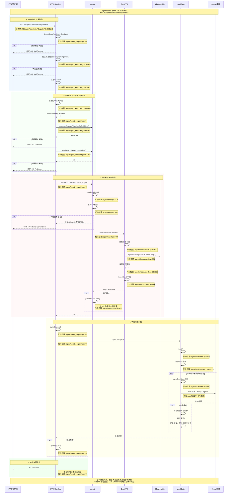

# Consul AgentCheckUpdate 方法实现与运行时序分析

## 概述

`AgentCheckUpdate` 是 Consul Agent HTTP API 中用于更新 TTL 检查状态的核心方法。该方法通过 `PUT /v1/agent/check/update/{checkID}` 端点提供服务，允许客户端主动更新健康检查的状态，并重置 TTL 计时器。

## 方法签名与位置

```go
func (s *HTTPHandlers) AgentCheckUpdate(resp http.ResponseWriter, req *http.Request) (interface{}, error) {
    var update checkUpdate
    if err := decodeBody(req.Body, &update); err != nil {
        return nil, HTTPError{StatusCode: http.StatusBadRequest, Reason: fmt.Sprintf("Request decode failed: %v", err)}
    }

    switch update.Status {
    case api.HealthPassing:
    case api.HealthWarning:
    case api.HealthCritical:
    default:
        return nil, HTTPError{StatusCode: http.StatusBadRequest, Reason: fmt.Sprintf("Invalid check status: '%s'", update.Status)}
    }

    id := strings.TrimPrefix(req.URL.Path, "/v1/agent/check/update/")
    checkID := types.CheckID(id)

    return s.agentCheckUpdate(resp, req, checkID, update.Status, update.Output)
}
```

**代码位置**: `agent/agent_endpoint.go:928-946`

## 时序图



## 时序图说明

时序图展示了从 HTTP 请求到状态同步完成的完整流程，包含以下主要阶段：

### 1. HTTP 请求处理阶段

**参与组件**: HTTP客户端 → HTTPHandlers

- **请求解析**: 解析 JSON 请求体到 `checkUpdate` 结构体
- **状态验证**: 验证状态值是否为有效的健康状态
- **CheckID 提取**: 从 URL 路径中提取检查标识符

**关键代码位置**:
- 请求解析: `agent/agent_endpoint.go:930`
- 状态验证: `agent/agent_endpoint.go:934-940`
- CheckID 提取: `agent/agent_endpoint.go:942-943`

### 2. 权限验证和元数据处理阶段

**参与组件**: HTTPHandlers → Agent

```go
func (s *HTTPHandlers) agentCheckUpdate(resp http.ResponseWriter, req *http.Request, checkID types.CheckID, status string, output string) (interface{}, error) {
    entMeta := acl.NewEnterpriseMetaWithPartition(s.agent.config.PartitionOrDefault(), "")
    cid := structs.NewCheckID(checkID, &entMeta)

    // Get the provided token, if any, and vet against any ACL policies.
    var token string
    s.parseToken(req, &token)

    if err := s.parseEntMetaNoWildcard(req, &cid.EnterpriseMeta); err != nil {
        return nil, err
    }

    authz, err := s.agent.delegate.ResolveTokenAndDefaultMeta(token, &cid.EnterpriseMeta, nil)
    if err != nil {
        return nil, err
    }

    cid.Normalize()

    if err := s.agent.vetCheckUpdateWithAuthorizer(authz, cid); err != nil {
        return nil, err
    }

    if !s.validateRequestPartition(resp, &cid.EnterpriseMeta) {
        return nil, nil
    }

    if err := s.agent.updateTTLCheck(cid, status, output); err != nil {
        return nil, err
    }
    s.syncChanges()
    return nil, nil
}
```

**代码位置**: `agent/agent_endpoint.go:948-980`

- **令牌解析**: 从请求中提取和验证 ACL 令牌
- **权限检查**: 验证客户端是否有权限更新指定检查
- **元数据处理**: 处理企业版相关的命名空间和分区信息

**关键代码位置**:
- 令牌解析: `agent/agent_endpoint.go:954`
- 权限验证: `agent/agent_endpoint.go:967-969`
- 元数据处理: `agent/agent_endpoint.go:956-958`

### 3. TTL 检查更新阶段

**参与组件**: HTTPHandlers → Agent → CheckTTL → CheckNotifier

这是整个流程的核心阶段，涉及以下关键步骤：

#### 3.1 状态锁获取
```go
// agent/agent.go:3478
func (a *Agent) updateTTLCheck(checkID structs.CheckID, status, output string) error {
    a.stateLock.Lock()
    defer a.stateLock.Unlock()

    // Grab the TTL check.
    check, ok := a.checkTTLs[checkID]
    if !ok {
        return fmt.Errorf("CheckID %q does not have associated TTL", checkID.String())
    }

    // Set the status through CheckTTL to reset the TTL.
    outputTruncated := check.SetStatus(status, output)

    // We don't write any files in dev mode so bail here.
    if a.config.DataDir == "" {
        return nil
    }

    // Persist the state so the TTL check can come up in a good state after
    // an agent restart, especially with long TTL values.
    if err := a.persistCheckState(check, status, outputTruncated); err != nil {
        return fmt.Errorf("failed persisting state for check %q: %s", checkID.String(), err)
    }

    return nil
}
```

**代码位置**: `agent/agent.go:3477-3502`

#### 3.2 CheckTTL.SetStatus 方法详解

```go
// agent/checks/check.go:313-331
func (c *CheckTTL) SetStatus(status, output string) string {
    c.Logger.Debug("Check status updated",
        "check", c.CheckID.String(),
        "status", status,
    )
    total := len(output)
    if total > c.OutputMaxSize {
        output = fmt.Sprintf("%s ... (captured %d of %d bytes)",
            output[:c.OutputMaxSize], c.OutputMaxSize, total)
    }
    c.Notify.UpdateCheck(c.CheckID, status, output)
    // Store the last output so we can retain it if the TTL expires.
    c.lastOutputLock.Lock()
    c.lastOutput = output
    c.lastOutputLock.Unlock()

    c.timer.Reset(c.TTL)
    return output
}
```

**关键步骤**:
1. **输出截断**: 如果输出超过最大长度则进行截断
2. **状态通知**: 调用 `CheckNotifier.UpdateCheck` 更新检查状态
3. **输出保存**: 存储最后的输出用于 TTL 过期时使用
4. **计时器重置**: 重置 TTL 计时器，延长检查的有效期

#### 3.3 状态持久化

在生产模式下，检查状态会被持久化到磁盘：

```go
// agent/agent.go:3507-3520+
func (a *Agent) persistCheckState(check *checks.CheckTTL, status, output string) error {
    // Create the persisted state
    state := persistedCheckState{
        CheckID:        check.CheckID.ID,
        Status:         status,
        Output:         output,
        Expires:        time.Now().Add(check.TTL).Unix(),
        EnterpriseMeta: check.CheckID.EnterpriseMeta,
    }

    // Encode the state
    buf, err := json.Marshal(state)
    if err != nil {
        return err
    }
    // ... 写入文件逻辑
}
```

### 4. 状态同步阶段

**参与组件**: HTTPHandlers → LocalState → AntiEntropy → Consul集群

#### 4.1 同步触发
```go
// agent/agent_endpoint.go:775-782
func (s *HTTPHandlers) syncChanges() {
    if err := s.agent.State.SyncChanges(); err != nil {
        s.agent.logger.Error("failed to sync changes", "error", err)
    }
}
```

#### 4.2 Anti-Entropy 同步机制

```go
// agent/local/state.go:1258-1316
func (l *State) SyncChanges() error {
    l.Lock()
    defer l.Unlock()

    // 首先同步节点级别的信息
    if l.nodeInfoInSync {
        l.logger.Debug("Node info in sync")
    } else {
        if err := l.syncNodeInfo(); err != nil {
            return err
        }
    }

    var errs error
    // 同步所有服务
    for id, s := range l.services {
        var err error
        switch {
        case s.Deleted:
            err = l.deleteService(id)
        case !s.InSync:
            err = l.syncService(id)
        default:
            l.logger.Debug("Service in sync", "service", id.String())
        }
        if err != nil {
            errs = multierror.Append(errs, err)
        }
    }

    // 同步所有检查
    for id, c := range l.checks {
        var err error
        switch {
        case c.Deleted:
            err = l.deleteCheck(id)
        case !c.InSync:
            if c.DeferCheck != nil {
                c.DeferCheck.Stop()
                c.DeferCheck = nil
            }
            err = l.syncCheck(id)
        default:
            l.logger.Debug("Check in sync", "check", id.String())
        }
        if err != nil {
            errs = multierror.Append(errs, err)
        }
    }
    return errs
}
```

## 关键数据结构

### checkUpdate 结构体
```go
type checkUpdate struct {
    Status string  // "passing", "warning", "critical"
    Output string  // 检查输出信息
}
```

### CheckTTL 结构体
```go
type CheckTTL struct {
    Notify    CheckNotifier
    CheckID   structs.CheckID
    ServiceID structs.ServiceID
    TTL       time.Duration
    Logger    hclog.Logger

    timer *time.Timer

    lastOutput     string
    lastOutputLock sync.RWMutex

    stop     bool
    stopCh   chan struct{}
    stopLock sync.Mutex

    OutputMaxSize int
}
```

## 错误处理机制

### 1. 请求级别错误
- **JSON 解析失败**: 返回 HTTP 400 Bad Request
- **状态值无效**: 返回 HTTP 400 Bad Request  
- **权限不足**: 返回 HTTP 403 Forbidden

### 2. 业务逻辑错误
- **TTL 检查不存在**: 返回 HTTP 500 Internal Server Error
- **状态持久化失败**: 返回错误但不影响内存状态

### 3. 同步错误处理
- **同步失败**: 记录错误日志但不影响 API 响应
- **重试机制**: Anti-Entropy 机制会在后续周期中重试同步

## 时序图详细解读

### 阶段划分与颜色编码

时序图使用不同的背景颜色来区分各个处理阶段：

- **蓝色区域** (rgb(240, 248, 255)): HTTP请求处理阶段
- **绿色区域** (rgb(248, 255, 248)): 权限验证和元数据处理阶段
- **红色区域** (rgb(255, 248, 248)): TTL检查更新阶段
- **黄色区域** (rgb(255, 255, 240)): 状态同步阶段
- **浅绿区域** (rgb(240, 255, 240)): 响应返回阶段

### 关键交互点分析

1. **错误处理分支**: 时序图清晰展示了各种错误情况的处理路径
2. **状态锁机制**: 突出显示了并发控制的关键点
3. **异步同步**: 展示了状态同步不阻塞API响应的设计
4. **代码位置标记**: 每个关键步骤都标注了精确的源码位置

### 性能关键路径

时序图突出了以下性能关键路径：
- **锁持有时间**: `stateLock` 的获取和释放
- **同步操作**: Anti-Entropy 机制的批量处理
- **持久化操作**: 状态文件的写入操作

## 总结

`AgentCheckUpdate` 方法实现了一个完整的 TTL 检查更新流程，体现了 Consul 的核心设计原则：

1. **安全性**: 完整的 ACL 权限验证机制
2. **可靠性**: 状态持久化和错误处理
3. **一致性**: Anti-Entropy 机制保证最终一致性
4. **性能**: 异步同步和批量操作优化

通过时序图可以清楚地理解整个检查更新流程，从 HTTP 请求处理到集群状态同步的完整过程。时序图中的代码位置标记使得开发者可以快速定位到具体的实现细节，便于深入理解和调试。
