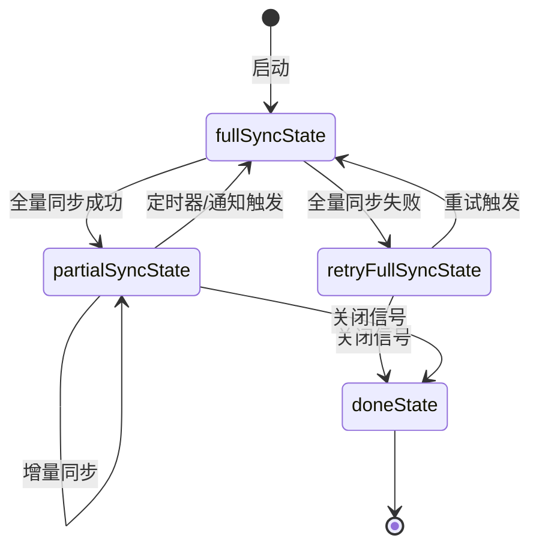
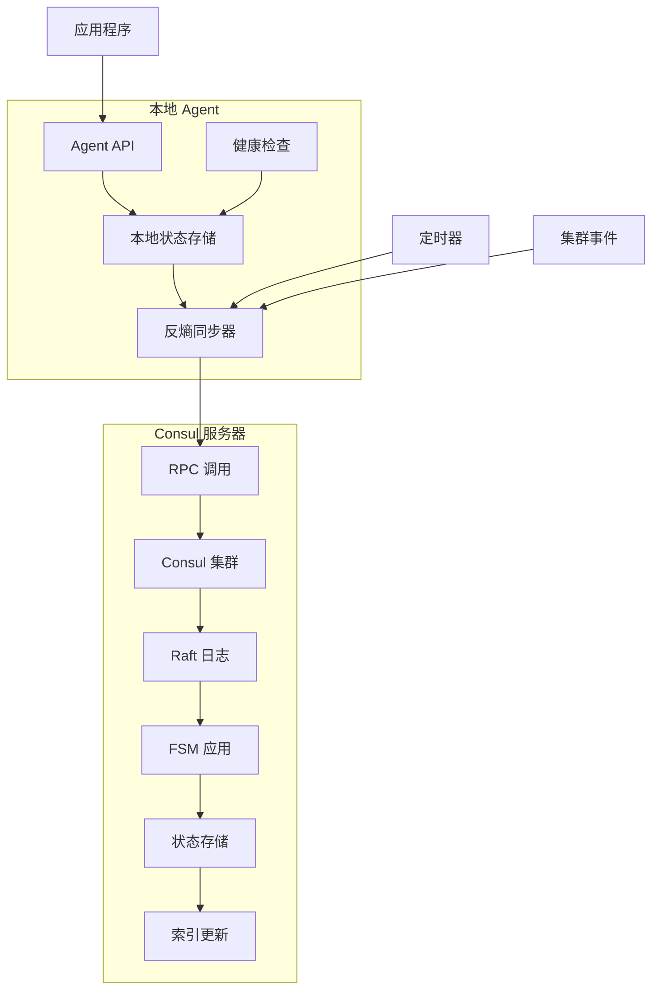

# Consul 反熵同步机制详解

## 概述

反熵同步机制（Anti-Entropy Synchronization）是 Consul 中确保分布式系统数据最终一致性的核心机制。它通过主动检测和修复数据不一致来对抗系统的"熵增"。

## 什么是反熵（Anti-Entropy）

### 1. 物理学概念
- **熵（Entropy）**: 系统无序度的度量，自然趋向于增加
- **反熵（Anti-Entropy）**: 主动减少系统无序度，维持系统有序状态

### 2. 分布式系统中的反熵
在分布式系统中，反熵指的是：
- **主动检测**数据不一致
- **自动修复**状态差异
- **确保最终一致性**

## Consul 反熵同步架构

### 1. 核心组件

#### StateSyncer 结构体
**位置**: `agent/ae/ae.go:57`

```go
type StateSyncer struct {
    // 需要同步的状态数据
    State SyncState
    
    // 全量同步间隔
    Interval time.Duration
    
    // 关闭信号
    ShutdownCh chan struct{}
    
    // 日志记录器
    Logger hclog.Logger
    
    // 集群大小函数（用于错峰同步）
    ClusterSize func() int
    
    // 全量同步触发器
    SyncFull *Trigger
    
    // 增量同步触发器
    SyncChanges *Trigger
    
    // 暂停控制
    pauseLock    sync.Mutex
    paused       int
    hardDisabled bool
}
```

#### SyncState 接口
**位置**: `agent/ae/ae.go:45`

```go
type SyncState interface {
    SyncChanges() error  // 增量同步
    SyncFull() error     // 全量同步
}
```

### 2. 工作原理

#### 2.1 状态机模式
反熵同步使用有限状态机（FSM）管理同步流程：

```go
// 状态定义
const (
    doneState          fsmState = "done"          // 完成状态
    fullSyncState      fsmState = "fullSync"      // 全量同步
    partialSyncState   fsmState = "partialSync"   // 增量同步
    retryFullSyncState fsmState = "retryFullSync" // 重试全量同步
)
```

#### 2.2 状态转换流程



### 3. 同步类型

#### 3.1 全量同步 (SyncFull)
**触发条件**:
- 定时触发（默认间隔）
- 新服务器加入集群
- 增量同步失败后的回退

**工作流程**:
```go
func (s *StateSyncer) nextFSMState(fs fsmState) fsmState {
    switch fs {
    case fullSyncState:
        if s.Paused() {
            return retryFullSyncState
        }
        
        if err := s.State.SyncFull(); err != nil {
            s.Logger.Error("failed to sync remote state", "error", err)
            return retryFullSyncState
        }
        
        return partialSyncState
    }
}
```

#### 3.2 增量同步 (SyncChanges)
**触发条件**:
- 本地状态变更
- 手动触发同步
- 定期检查变更

**工作流程**:
```go
case syncChangesNotifEvent:
    if s.Paused() {
        return partialSyncState
    }
    
    err := s.State.SyncChanges()
    if err != nil {
        s.Logger.Error("failed to sync changes", "error", err)
    }
    return partialSyncState
```

### 4. 本地状态同步实现

#### 4.1 本地状态管理
**位置**: `agent/local/state.go`

```go
type State struct {
    sync.RWMutex
    
    // 服务状态映射
    services map[structs.ServiceID]*ServiceState
    
    // 检查状态映射
    checks map[structs.CheckID]*CheckState
    
    // 同步触发函数
    TriggerSyncChanges func()
    
    // 节点信息同步状态
    nodeInfoInSync bool
}
```

#### 4.2 服务状态结构
```go
type ServiceState struct {
    Service *structs.NodeService
    Token   string
    InSync  bool  // 是否已同步
    Deleted bool  // 是否已删除
}
```

#### 4.3 检查状态结构
```go
type CheckState struct {
    Check   *structs.HealthCheck
    Token   string
    InSync  bool
    Deleted bool
}
```

### 5. 同步流程详解

#### 5.1 增量同步流程
**位置**: `agent/local/state.go:1245`

```go
func (l *State) SyncChanges() error {
    l.Lock()
    defer l.Unlock()
    
    // 1. 同步节点信息
    if !l.nodeInfoInSync {
        if err := l.syncNodeInfo(); err != nil {
            return err
        }
    }
    
    // 2. 同步服务
    for id, s := range l.services {
        if !s.InSync {
            if err := l.syncService(id, s); err != nil {
                return err
            }
        }
    }
    
    // 3. 同步检查
    for id, c := range l.checks {
        if !c.InSync {
            if err := l.syncCheck(id, c); err != nil {
                return err
            }
        }
    }
    
    return nil
}
```

#### 5.2 服务同步实现
```go
func (l *State) syncService(id structs.ServiceID, s *ServiceState) error {
    if s.Deleted {
        // 删除远程服务
        req := structs.DeregisterRequest{
            Node:      l.config.NodeName,
            ServiceID: id.ID,
        }
        if err := l.Delegate.RPC("Catalog.Deregister", &req, &struct{}{}); err != nil {
            return err
        }
        delete(l.services, id)
    } else {
        // 注册/更新远程服务
        req := structs.RegisterRequest{
            Node:    l.config.NodeName,
            Service: s.Service,
        }
        if err := l.Delegate.RPC("Catalog.Register", &req, &struct{}{}); err != nil {
            return err
        }
        s.InSync = true
    }
    return nil
}
```

### 6. 性能优化机制

#### 6.1 错峰同步
**位置**: `agent/ae/ae.go:32`

```go
func scaleFactor(nodes int) int {
    if nodes <= scaleThreshold {
        return 1.0
    }
    // 使用 log2 缩放，集群大小翻倍时延迟翻倍
    return int(math.Ceil(math.Log2(float64(nodes))-math.Log2(float64(scaleThreshold))) + 1.0)
}
```

**目的**:
- 避免大集群中的"雷群效应"
- 根据集群大小动态调整同步间隔
- 分散同步负载

#### 6.2 触发器机制
**位置**: `agent/ae/trigger.go`

```go
type Trigger struct {
    ch chan struct{}
}

func (t Trigger) Trigger() {
    select {
    case t.ch <- struct{}{}:  // 非阻塞发送
    default:                  // 如果通道满了就丢弃
    }
}
```

**特点**:
- 非阻塞触发
- 防止重复触发
- 高效的事件通知

### 7. 冲突解决策略

#### 7.1 时间戳比较
```go
// 比较修改时间，选择最新的版本
if remoteMod > lastRemoteIndex && !bytes.Equal(remoteHash, localHash) {
    res.LocalUpserts = append(res.LocalUpserts, remoteID)
}
```

#### 7.2 哈希值验证
```go
// 使用哈希值检测数据是否真正不同
if !bytes.Equal(remoteHash, localHash) {
    // 需要更新
}
```

#### 7.3 Raft 索引优先
- 使用 Raft 日志索引作为权威时间戳
- 较高索引的数据优先
- 确保因果一致性

### 8. 监控和调试

#### 8.1 日志记录
```go
s.Logger.Debug("acl replication",
    "deletions", len(res.LocalDeletes),
    "updates", len(res.LocalUpserts),
)
```

#### 8.2 指标收集
- 同步频率统计
- 同步延迟监控
- 冲突解决计数
- 错误率统计

### 9. 具体同步的信息类型

#### 9.1 节点信息同步

**同步内容**:
```go
type Node struct {
    ID              string                 // 节点唯一标识
    Node            string                 // 节点名称
    Address         string                 // 节点 IP 地址
    Datacenter      string                 // 数据中心名称
    TaggedAddresses map[string]string      // 标记地址（如 WAN 地址）
    Meta            map[string]string      // 节点元数据
    CreateIndex     uint64                 // 创建索引
    ModifyIndex     uint64                 // 修改索引
}
```

**同步时机**:
- Agent 启动时
- 节点元数据变更时
- 地址信息更新时

**同步方法**:
```go
func (l *State) syncNodeInfo() error {
    req := structs.RegisterRequest{
        Datacenter:      l.config.Datacenter,
        ID:              l.config.NodeID,
        Node:            l.config.NodeName,
        Address:         l.config.AdvertiseAddr,
        TaggedAddresses: l.config.TaggedAddresses,
        NodeMeta:        l.metadata,
    }

    var out struct{}
    err := l.Delegate.RPC("Catalog.Register", &req, &out)
    if err == nil {
        l.nodeInfoInSync = true
    }
    return err
}
```

#### 9.2 服务信息同步

**同步内容**:
```go
type NodeService struct {
    Kind              ServiceKind            // 服务类型（普通服务、Connect 代理等）
    ID                string                 // 服务实例 ID
    Service           string                 // 服务名称
    Tags              []string               // 服务标签
    Address           string                 // 服务地址
    TaggedAddresses   map[string]ServiceAddress // 标记地址
    Meta              map[string]string      // 服务元数据
    Port              int                    // 服务端口
    Weights           *Weights               // 权重配置
    EnableTagOverride bool                   // 是否允许标签覆盖
    Proxy             *ConnectProxyConfig    // Connect 代理配置
    Connect           *ServiceConnect        // Connect 配置
    LocallyRegisteredAsSidecar bool         // 是否作为 Sidecar 注册
    CreateIndex       uint64                 // 创建索引
    ModifyIndex       uint64                 // 修改索引
}
```

**服务状态管理**:
```go
type ServiceState struct {
    Service *structs.NodeService  // 服务定义
    Token   string                // ACL Token
    InSync  bool                  // 是否已同步到集群
    Deleted bool                  // 是否已标记删除
}
```

**同步场景**:
- **服务注册**: 新服务注册到本地 Agent
- **服务注销**: 服务从本地 Agent 注销
- **服务更新**: 服务配置（端口、标签、元数据）变更
- **Connect 配置**: Service Mesh 相关配置变更

**同步实现**:
```go
func (l *State) syncService(id structs.ServiceID, s *ServiceState) error {
    if s.Deleted {
        // 注销服务
        req := structs.DeregisterRequest{
            Datacenter: l.config.Datacenter,
            Node:       l.config.NodeName,
            ServiceID:  id.ID,
            EnterpriseMeta: id.EnterpriseMeta,
        }
        err := l.Delegate.RPC("Catalog.Deregister", &req, &struct{}{})
        if err == nil {
            delete(l.services, id)
        }
        return err
    } else {
        // 注册/更新服务
        req := structs.RegisterRequest{
            Datacenter: l.config.Datacenter,
            ID:         l.config.NodeID,
            Node:       l.config.NodeName,
            Address:    l.config.AdvertiseAddr,
            Service:    s.Service,
            WriteRequest: structs.WriteRequest{Token: s.Token},
        }
        err := l.Delegate.RPC("Catalog.Register", &req, &struct{}{})
        if err == nil {
            s.InSync = true
        }
        return err
    }
}
```

#### 9.3 健康检查信息同步

**同步内容**:
```go
type HealthCheck struct {
    Node        string             // 节点名称
    CheckID     string             // 检查 ID
    Name        string             // 检查名称
    Status      string             // 检查状态（passing/warning/critical）
    Notes       string             // 检查说明
    Output      string             // 检查输出
    ServiceID   string             // 关联的服务 ID
    ServiceName string             // 关联的服务名称
    ServiceTags []string           // 服务标签
    Type        string             // 检查类型
    Interval    string             // 检查间隔
    Timeout     string             // 检查超时
    CreateIndex uint64             // 创建索引
    ModifyIndex uint64             // 修改索引
}
```

**检查状态管理**:
```go
type CheckState struct {
    Check   *structs.HealthCheck  // 检查定义
    Token   string                // ACL Token
    InSync  bool                  // 是否已同步
    Deleted bool                  // 是否已删除
}
```

**检查类型同步**:

1. **HTTP 检查**:
```go
type CheckHTTP struct {
    CheckID  string
    HTTP     string              // HTTP URL
    Header   map[string][]string // HTTP 头
    Method   string              // HTTP 方法
    Body     string              // 请求体
    Interval time.Duration       // 检查间隔
    Timeout  time.Duration       // 超时时间
    TLS      bool                // 是否使用 TLS
}
```

2. **TCP 检查**:
```go
type CheckTCP struct {
    CheckID  string
    TCP      string              // TCP 地址
    Interval time.Duration       // 检查间隔
    Timeout  time.Duration       // 超时时间
}
```

3. **TTL 检查**:
```go
type CheckTTL struct {
    CheckID string
    TTL     time.Duration        // 生存时间
}
```

4. **脚本检查**:
```go
type CheckMonitor struct {
    CheckID  string
    Script   string              // 脚本路径
    Args     []string            // 脚本参数
    Interval time.Duration       // 检查间隔
    Timeout  time.Duration       // 超时时间
}
```

**同步实现**:
```go
func (l *State) syncCheck(id structs.CheckID, c *CheckState) error {
    if c.Deleted {
        // 删除检查
        req := structs.DeregisterRequest{
            Datacenter: l.config.Datacenter,
            Node:       l.config.NodeName,
            CheckID:    id.ID,
            EnterpriseMeta: id.EnterpriseMeta,
        }
        err := l.Delegate.RPC("Catalog.Deregister", &req, &struct{}{})
        if err == nil {
            delete(l.checks, id)
        }
        return err
    } else {
        // 注册/更新检查
        req := structs.RegisterRequest{
            Datacenter: l.config.Datacenter,
            ID:         l.config.NodeID,
            Node:       l.config.NodeName,
            Address:    l.config.AdvertiseAddr,
            Check:      c.Check,
            WriteRequest: structs.WriteRequest{Token: c.Token},
        }
        err := l.Delegate.RPC("Catalog.Register", &req, &struct{}{})
        if err == nil {
            c.InSync = true
        }
        return err
    }
}
```

#### 9.4 ACL 信息同步

**同步内容**:
```go
// ACL Token 同步
type ACLToken struct {
    AccessorID  string            // 访问器 ID
    SecretID    string            // 密钥 ID
    Description string            // 描述
    Policies    []ACLTokenPolicyLink // 关联策略
    Roles       []ACLTokenRoleLink   // 关联角色
    Local       bool              // 是否为本地 Token
    CreateTime  time.Time         // 创建时间
    Hash        []byte            // 哈希值
    CreateIndex uint64            // 创建索引
    ModifyIndex uint64            // 修改索引
}

// ACL Policy 同步
type ACLPolicy struct {
    ID          string            // 策略 ID
    Name        string            // 策略名称
    Description string            // 描述
    Rules       string            // 策略规则
    Syntax      acl.SyntaxVersion // 语法版本
    Hash        []byte            // 哈希值
    CreateIndex uint64            // 创建索引
    ModifyIndex uint64            // 修改索引
}
```

**同步场景**:
- 主数据中心到辅助数据中心的 ACL 复制
- Token 和 Policy 的增量同步
- 权限变更的实时同步

#### 9.5 配置条目同步

**同步内容**:
```go
// 服务配置
type ServiceConfigEntry struct {
    Kind        string            // 配置类型
    Name        string            // 服务名称
    Protocol    string            // 协议类型
    MeshGateway MeshGatewayConfig // 网格网关配置
    Expose      ExposeConfig      // 暴露配置
    CreateIndex uint64            // 创建索引
    ModifyIndex uint64            // 修改索引
}

// 代理默认配置
type ProxyConfigEntry struct {
    Kind        string            // 配置类型
    Name        string            // 配置名称
    Config      map[string]interface{} // 代理配置
    MeshGateway MeshGatewayConfig // 网格网关配置
    CreateIndex uint64            // 创建索引
    ModifyIndex uint64            // 修改索引
}
```

**同步场景**:
- 中央配置变更同步
- 服务默认配置同步
- Connect 代理配置同步

#### 9.6 联邦状态同步

**同步内容**:
```go
type FederationState struct {
    Datacenter  string            // 数据中心名称
    MeshGateways []CheckServiceNode // 网格网关列表
    UpdatedAt   time.Time         // 更新时间
    CreateIndex uint64            // 创建索引
    ModifyIndex uint64            // 修改索引
}
```

**同步场景**:
- 跨数据中心的网格网关信息同步
- 联邦集群状态同步
- WAN 网络拓扑同步

### 10. 同步数据的生命周期

#### 10.1 数据创建流程
```
本地创建 → 标记未同步 → 触发增量同步 → 同步到集群 → 标记已同步
```

#### 10.2 数据更新流程
```
本地更新 → 标记未同步 → 触发增量同步 → 更新集群 → 标记已同步
```

#### 10.3 数据删除流程
```
本地删除 → 标记为删除 → 触发增量同步 → 从集群删除 → 清理本地状态
```

#### 10.4 冲突解决流程
```
检测冲突 → 比较时间戳/索引 → 选择权威版本 → 应用变更 → 标记已同步
```

### 11. 使用场景总结

#### 11.1 服务注册同步
- **目的**: 确保服务发现的一致性
- **内容**: 服务定义、端口、标签、元数据
- **频率**: 实时同步 + 定期全量同步

#### 11.2 健康检查同步
- **目的**: 维护全局健康状态
- **内容**: 检查状态、输出信息、检查配置
- **频率**: 高频同步（健康状态变化频繁）

#### 11.3 配置管理同步
- **目的**: 中央配置一致性
- **内容**: 服务配置、代理配置、ACL 策略
- **频率**: 配置变更时同步

### 12. 同步数据流向分析

#### 12.1 数据流向图



#### 12.2 同步数据的存储位置

**本地存储**:
```go
// agent/local/state.go
type State struct {
    // 服务状态映射
    services map[structs.ServiceID]*ServiceState

    // 检查状态映射
    checks map[structs.CheckID]*CheckState

    // 节点元数据
    metadata map[string]string

    // 同步状态标记
    nodeInfoInSync bool
}
```

**集群存储**:
```go
// agent/consul/state/catalog.go
// 使用 MemDB 存储，支持事务和索引
func (s *Store) EnsureNode(idx uint64, node *structs.Node) error
func (s *Store) EnsureService(idx uint64, node string, svc *structs.NodeService) error
func (s *Store) EnsureCheck(idx uint64, hc *structs.HealthCheck) error
```

#### 12.3 同步过程中的数据转换

**本地到远程的数据转换**:
```go
// 本地服务状态转换为注册请求
func (l *State) serviceToRegisterRequest(s *ServiceState) *structs.RegisterRequest {
    return &structs.RegisterRequest{
        Datacenter: l.config.Datacenter,
        ID:         l.config.NodeID,
        Node:       l.config.NodeName,
        Address:    l.config.AdvertiseAddr,
        Service:    s.Service,           // 服务定义
        Check:      nil,                 // 单独同步检查
        WriteRequest: structs.WriteRequest{
            Token: s.Token,              // ACL Token
        },
    }
}

// 本地检查状态转换为注册请求
func (l *State) checkToRegisterRequest(c *CheckState) *structs.RegisterRequest {
    return &structs.RegisterRequest{
        Datacenter: l.config.Datacenter,
        ID:         l.config.NodeID,
        Node:       l.config.NodeName,
        Address:    l.config.AdvertiseAddr,
        Service:    nil,                 // 单独同步服务
        Check:      c.Check,             // 检查定义
        WriteRequest: structs.WriteRequest{
            Token: c.Token,              // ACL Token
        },
    }
}
```

### 13. 同步性能监控

#### 13.1 关键性能指标

**同步延迟指标**:
```go
// 同步操作耗时
consul.agent.sync_duration_ms

// 全量同步间隔
consul.agent.sync_full_interval_ms

// 增量同步频率
consul.agent.sync_changes_rate
```

**同步成功率指标**:
```go
// 同步成功次数
consul.agent.sync_success_total

// 同步失败次数
consul.agent.sync_failure_total

// 同步重试次数
consul.agent.sync_retry_total
```

**数据一致性指标**:
```go
// 未同步的服务数量
consul.agent.services_not_in_sync

// 未同步的检查数量
consul.agent.checks_not_in_sync

// 同步队列长度
consul.agent.sync_queue_length
```

#### 13.2 监控实现示例

```go
// 同步操作监控
func (l *State) SyncChanges() error {
    start := time.Now()
    defer func() {
        duration := time.Since(start)
        metrics.MeasureSince([]string{"agent", "sync", "changes"}, start)
        l.logger.Debug("sync changes completed", "duration", duration)
    }()

    // 统计未同步项目
    var notInSyncServices, notInSyncChecks int
    for _, s := range l.services {
        if !s.InSync {
            notInSyncServices++
        }
    }
    for _, c := range l.checks {
        if !c.InSync {
            notInSyncChecks++
        }
    }

    metrics.SetGauge([]string{"agent", "services", "not_in_sync"}, float32(notInSyncServices))
    metrics.SetGauge([]string{"agent", "checks", "not_in_sync"}, float32(notInSyncChecks))

    // 执行同步逻辑...
    return nil
}
```

#### 13.3 告警配置建议

**同步延迟告警**:
```yaml
# Prometheus 告警规则示例
- alert: ConsulSyncHighLatency
  expr: consul_agent_sync_duration_ms > 5000
  for: 2m
  labels:
    severity: warning
  annotations:
    summary: "Consul agent sync latency is high"
    description: "Agent {{ $labels.instance }} sync latency is {{ $value }}ms"
```

**同步失败告警**:
```yaml
- alert: ConsulSyncFailureRate
  expr: rate(consul_agent_sync_failure_total[5m]) > 0.1
  for: 1m
  labels:
    severity: critical
  annotations:
    summary: "Consul agent sync failure rate is high"
    description: "Agent {{ $labels.instance }} sync failure rate is {{ $value }}"
```

### 14. 故障排查指南

#### 14.1 常见同步问题

**问题 1: 服务未出现在集群中**
```bash
# 检查本地状态
consul members
consul catalog services

# 检查 Agent 日志
tail -f /var/log/consul/consul.log | grep sync

# 检查同步状态
curl http://localhost:8500/v1/agent/self | jq '.Stats.agent'
```

**问题 2: 健康检查状态不一致**
```bash
# 检查本地检查状态
curl http://localhost:8500/v1/agent/checks

# 检查集群检查状态
curl http://localhost:8500/v1/health/node/node-name

# 强制触发同步
consul reload
```

**问题 3: 同步延迟过高**
```bash
# 检查集群大小和错峰配置
consul members | wc -l

# 检查网络延迟
ping consul-server

# 检查 RPC 性能
consul monitor -log-level=debug | grep RPC
```

#### 14.2 调试工具

**启用调试日志**:
```bash
# 临时启用调试日志
consul monitor -log-level=debug

# 配置文件启用
{
  "log_level": "DEBUG",
  "enable_debug": true
}
```

**手动触发同步**:
```bash
# 发送 SIGUSR1 信号触发同步
kill -USR1 <consul-pid>

# 或使用 API
curl -X PUT http://localhost:8500/v1/agent/force-leave/node-name
```

### 15. 最佳实践

#### 15.1 配置优化
```go
// 根据集群大小调整同步间隔
interval := baseInterval * scaleFactor(clusterSize)

// 配置合适的超时时间
timeout := 30 * time.Second

// 设置合理的重试次数
maxRetries := 3
```

#### 15.2 错误处理
```go
// 实现指数退避重试
func (l *State) syncWithBackoff(operation func() error) error {
    var err error
    for attempt := 0; attempt < maxRetries; attempt++ {
        if err = operation(); err == nil {
            return nil
        }

        backoff := time.Duration(attempt) * baseDelay
        time.Sleep(backoff)
        l.logger.Warn("sync operation failed, retrying",
            "attempt", attempt+1, "error", err, "backoff", backoff)
    }
    return err
}
```

#### 15.3 监控告警
- **监控同步延迟**: 设置合理的延迟阈值
- **监控同步失败率**: 及时发现网络或配置问题
- **监控数据不一致**: 跟踪未同步的项目数量
- **监控集群健康**: 确保 Consul 集群正常运行

#### 15.4 容量规划
```go
// 根据数据量估算同步性能
servicesPerNode := 100
checksPerService := 3
totalItems := servicesPerNode * (1 + checksPerService)

// 估算同步时间
syncTimePerItem := 10 * time.Millisecond
estimatedSyncTime := time.Duration(totalItems) * syncTimePerItem
```

## 总结

Consul 的反熵同步机制是一个精心设计的分布式一致性保证系统，涵盖了完整的数据同步生态：

### 同步数据类型全覆盖
1. **节点信息**: 节点 ID、地址、元数据、标记地址
2. **服务信息**: 服务定义、端口配置、标签、Connect 配置
3. **健康检查**: HTTP/TCP/TTL/脚本检查及其状态
4. **ACL 信息**: Token、Policy、Role 的权限数据
5. **配置条目**: 服务配置、代理配置、中央配置
6. **联邦状态**: 跨数据中心的网格网关信息

### 核心技术特性
1. **自愈能力**: 自动检测和修复数据不一致
2. **性能优化**: 错峰同步、非阻塞触发、增量更新
3. **可靠性**: 状态机管理、重试机制、冲突解决
4. **可扩展性**: 根据集群大小动态调整同步策略
5. **可观测性**: 完善的日志、指标和监控体系

### 数据流向和生命周期
- **创建流程**: 本地创建 → 标记未同步 → 增量同步 → 集群存储
- **更新流程**: 本地更新 → 重新标记 → 增量同步 → 集群更新
- **删除流程**: 标记删除 → 同步删除 → 集群清理 → 本地清理
- **冲突解决**: 时间戳比较 → 哈希验证 → Raft 索引优先

### 监控和运维支持
- **性能指标**: 同步延迟、成功率、队列长度
- **健康指标**: 未同步项目数、失败率、重试次数
- **告警机制**: 延迟告警、失败率告警、一致性告警
- **故障排查**: 调试日志、手动触发、状态检查

### 实际应用价值
这种机制确保了 Consul 在面对以下场景时的数据一致性：
- **网络分区恢复**: 自动同步分区期间的变更
- **节点故障恢复**: 重新加入时自动同步状态
- **配置变更**: 实时同步配置到所有节点
- **服务发现**: 确保服务注册信息的全局一致性
- **健康监控**: 维护准确的服务健康状态

反熵同步机制是 Consul 实现分布式一致性的核心技术，它不仅保证了数据的最终一致性，还通过精细的设计实现了高性能、高可用和强可观测性，是分布式系统设计的优秀实践典范。
