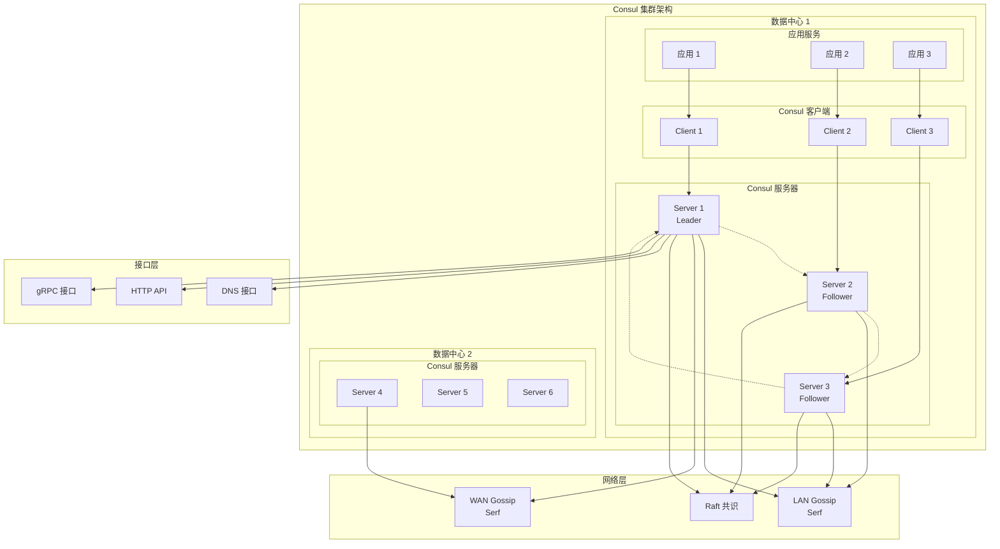

# Consul 架构概览

## 项目简介

Consul 是 HashiCorp 开发的分布式、高可用、数据中心感知的服务发现和配置管理解决方案。它为动态分布式基础设施中的应用程序连接和配置提供了完整的解决方案。

## 核心功能

- **多数据中心支持** - 原生支持多区域部署，无需复杂配置
- **服务网格** - 提供安全的服务间通信，支持自动 TLS 加密和基于身份的授权
- **API 网关** - 管理服务网格内服务的访问控制
- **服务发现** - 通过 DNS 或 HTTP 接口简化服务注册和发现
- **健康检查** - 快速检测集群问题，防止流量路由到不健康的主机
- **动态应用配置** - 通过 HTTP API 存储配置参数和应用元数据

## 整体架构



## 核心组件

### 1. Agent 代理
- **位置**: `agent/agent.go`
- **功能**: 运行在每台机器上的长期进程，提供 RPC 接口供 CLI 控制
- **模式**: 
  - 服务器模式：运行完整的 Consul 服务器
  - 客户端模式：仅转发请求到其他 Consul 服务器

### 2. Server 服务器
- **位置**: `agent/consul/server.go`
- **功能**: 管理服务发现、健康检查、数据中心转发、Raft 和多个 Serf 池
- **核心组件**:
  - Raft 共识算法实现
  - FSM (有限状态机)
  - ACL 解析器
  - 连接池管理

### 3. Client 客户端
- **位置**: `agent/consul/client.go`
- **功能**: 使用 RPC 与服务器通信，处理服务发现、健康检查和数据中心转发

### 4. 状态存储
- **位置**: `agent/consul/state/state_store.go`
- **功能**: 存储所有 Consul 状态，包括节点注册、服务、检查、KV 对等
- **特点**: 完全内存存储，通过 Raft 日志和 FSM 构建

## 数据存储架构

### Raft 共识算法
- **实现位置**: `agent/consul/raft_*.go`
- **功能**: 提供强一致性保证
- **组件**:
  - 日志存储 (LogStore)
  - 稳定存储 (StableStore)
  - 快照存储 (SnapshotStore)

### FSM 有限状态机
- **位置**: `agent/consul/fsm/fsm.go`
- **功能**: 与 Raft 配合提供强一致性
- **特点**: 处理状态变更命令，维护状态存储

### KV 存储
- **位置**: `agent/consul/state/kvs.go`
- **功能**: 键值存储，支持锁定、TTL、墓碑机制

## 网络架构

### Serf 集群管理
- **LAN Serf**: 数据中心内节点通信
- **WAN Serf**: 跨数据中心服务器通信
- **功能**: 成员管理、故障检测、事件传播

### 通信协议
- **RPC**: 内部服务间通信
- **gRPC**: 现代 API 接口
- **HTTP**: RESTful API
- **DNS**: 服务发现接口

## 服务发现机制

### DNS 接口
- **位置**: `agent/dns.go`
- **功能**: 通过 DNS 查询发现服务
- **支持**: A、AAAA、CNAME、SRV、PTR 记录

### HTTP API
- **位置**: `agent/http.go`
- **功能**: RESTful API 接口
- **端点**: 服务注册、健康检查、KV 操作等

### 服务注册
- **位置**: `agent/consul/catalog_endpoint.go`
- **功能**: 注册服务和健康检查
- **特点**: 支持节点、服务、检查的统一注册

## 安全架构

### ACL 访问控制
- **位置**: `acl/` 目录
- **功能**: 基于令牌的访问控制
- **组件**:
  - 策略管理
  - 令牌解析
  - 权限验证

### TLS 加密
- **位置**: `tlsutil/` 目录
- **功能**: 传输层安全
- **支持**: 服务间通信加密、证书管理

## 高可用性设计

### 领导者选举
- 基于 Raft 算法的领导者选举
- 自动故障转移
- 数据一致性保证

### 健康检查
- 节点健康监控
- 服务健康检查
- 自动故障检测和恢复

### 数据复制
- Raft 日志复制
- 跨数据中心状态同步
- 快照和恢复机制

## 扩展性特性

### 多数据中心
- WAN 联邦
- 跨数据中心服务发现
- 数据中心感知路由

### 网络分段 (企业版)
- 网络隔离
- 分段管理
- 安全边界

### 分区管理 (企业版)
- 租户隔离
- 资源分区
- 多租户支持

## 监控和调试

### 指标收集
- 内置指标系统
- Prometheus 兼容
- 性能监控

### 调试接口
- pprof 性能分析
- 调试端点
- 日志管理

## 源代码组织

```
consul/
├── agent/           # 代理实现
├── api/            # Go API 客户端
├── command/        # CLI 命令
├── connect/        # 服务网格
├── acl/           # 访问控制
├── internal/      # 内部组件
├── proto/         # Protocol Buffers
└── docs/          # 文档
```

这个架构概览为理解 Consul 的整体设计提供了基础。每个组件都有详细的实现文档，可以深入了解具体的技术细节。
