# Consul MemDB Schema 架构图

## 概述

本文档基于 Consul 源码分析，整理了完整的 MemDB 数据库模式，包括所有表结构、索引和关系。

## 目录

1. [Mermaid ER 图](#mermaid-er-图) - 可视化数据库架构
2. [表关系分析](#表关系分析) - 核心数据流和关系链路
3. [数据模型特点](#数据模型特点) - 多租户、版本控制、软删除等特性
4. [性能设计考量](#性能设计考量) - 内存优化、查询优化、一致性保证
5. [核心表结构](#核心表结构) - 详细的表结构和索引说明
6. [企业版扩展表](#企业版扩展表) - 企业版特有功能
7. [索引策略分析](#索引策略分析) - 索引类型和实现策略
8. [查询性能优化](#查询性能优化) - 性能优化技术
9. [数据一致性保证](#数据一致性保证) - 一致性机制
10. [扩展性设计](#扩展性设计) - 水平和垂直扩展能力

## Mermaid ER 图

以下是使用 Mermaid 创建的简洁 ER 图，展示了 Consul MemDB 的核心表结构和关系：

```mermaid
erDiagram
    %% 服务发现核心表
    NODES {
        string id PK "节点ID + 对等名称"
        string node "节点名称"
        string address "节点地址"
        string datacenter "数据中心"
        map tagged_addresses "标记地址"
        map meta "节点元数据"
        string peer_name "对等节点名称"
    }

    SERVICES {
        string id PK "节点 + 服务ID + 对等名称"
        string node FK "关联节点"
        string service_id "服务ID"
        string service_name "服务名称"
        array tags "服务标签"
        string address "服务地址"
        int port "服务端口"
        object weights "服务权重"
        bool enable_tag_override "允许标签覆盖"
        object proxy "代理配置"
        object connect "Connect配置"
        string peer_name "对等节点名称"
    }

    CHECKS {
        string id PK "节点 + 检查ID + 对等名称"
        string node FK "关联节点"
        string check_id "检查ID"
        string name "检查名称"
        string status "健康状态"
        string notes "检查说明"
        string output "检查输出"
        string service_id FK "关联服务ID"
        string service_name "服务名称"
        array service_tags "服务标签"
        string type "检查类型"
        string peer_name "对等节点名称"
    }

    %% ACL 权限控制表
    ACL_TOKENS {
        string accessor_id PK "访问器ID"
        string secret_id UK "密钥ID"
        string description "令牌描述"
        array policies "关联策略"
        array roles "关联角色"
        array service_identities "服务身份"
        array node_identities "节点身份"
        string type "令牌类型"
        string rules "规则"
        bytes hash "哈希值"
        datetime create_time "创建时间"
        duration expires_ttl "过期TTL"
        bool expires_global "全局过期"
        bool expires_local "本地过期"
    }

    ACL_POLICIES {
        string id PK "策略ID"
        string name UK "策略名称"
        string description "策略描述"
        string rules "策略规则"
        string syntax "语法版本"
        array datacenters "数据中心"
        bytes hash "哈希值"
    }

    ACL_ROLES {
        string id PK "角色ID"
        string name UK "角色名称"
        string description "角色描述"
        array policies "关联策略"
        array service_identities "服务身份"
        array node_identities "节点身份"
        bytes hash "哈希值"
    }

    %% 配置管理表
    CONFIG_ENTRIES {
        string id PK "类型 + 名称"
        string kind "配置类型"
        string name "配置名称"
        object config "配置数据"
        uint64 create_index "创建索引"
        uint64 modify_index "修改索引"
    }

    %% 会话和协调表
    SESSIONS {
        string id PK "会话ID"
        string name "会话名称"
        string node FK "关联节点"
        duration lock_delay "锁延迟"
        string behavior "会话行为"
        duration ttl "生存时间"
        array checks "关联检查"
    }

    SESSION_CHECKS {
        string session FK "会话ID"
        string node FK "节点名称"
        string check_id FK "检查ID"
    }

    COORDINATES {
        string node PK "节点名称"
        string segment PK "网络段"
        object coord "网络坐标"
    }

    %% KV 存储表
    KVS {
        string key PK "键名"
        bytes value "键值"
        uint64 flags "标志位"
        string session FK "关联会话"
        uint64 lock_index "锁索引"
        uint64 create_index "创建索引"
        uint64 modify_index "修改索引"
    }

    TOMBSTONES {
        string key PK "已删除的键名"
        uint64 index "删除索引"
    }

    %% 网络拓扑表
    MESH_TOPOLOGY {
        object upstream PK "上游服务"
        object downstream PK "下游服务"
        string kind "拓扑类型"
    }

    GATEWAY_SERVICES {
        object gateway PK "网关服务"
        object service PK "关联服务"
        string gateway_kind "网关类型"
        int port PK "端口"
        string protocol "协议"
        array hosts "主机列表"
        string ca_file "CA文件"
        string cert_file "证书文件"
        string key_file "密钥文件"
        string sni "SNI"
    }

    %% 集群对等表
    PEERING {
        string id PK "对等ID"
        string name UK "对等名称"
        string partition "分区"
        string state "对等状态"
        string peer_id "对等节点ID"
        array peer_ca_pems "对等CA证书"
        string peer_server_name "对等服务器名称"
        array peer_server_addresses "对等服务器地址"
        uint64 create_index "创建索引"
        uint64 modify_index "修改索引"
        datetime deleted_at "删除时间"
    }

    PEERING_TRUST_BUNDLES {
        string trust_domain PK "信任域"
        string peer_name "对等名称"
        string partition "分区"
        array root_pems "根证书"
        string exported_partition "导出分区"
        uint64 create_index "创建索引"
        uint64 modify_index "修改索引"
    }

    %% 查询表
    PREPARED_QUERIES {
        string id PK "查询ID"
        string name UK "查询名称"
        string session FK "关联会话"
        string token "ACL令牌"
        object template "查询模板"
        object service "查询服务"
    }

    %% 系统管理表
    INDEX_TABLE {
        string key PK "索引键"
        uint64 value "索引值"
    }

    SYSTEM_METADATA {
        string key PK "元数据键"
        string value "元数据值"
    }

    AUTOPILOT_CONFIG {
        bool cleanup_dead_servers "清理死亡服务器"
        duration last_contact_threshold "最后联系阈值"
        uint64 max_trailing_logs "最大滞后日志"
        uint min_quorum "最小法定人数"
        duration server_stabilization_time "服务器稳定时间"
        string redundancy_zone_tag "冗余区域标签"
        bool disable_upgrade_migration "禁用升级迁移"
        string upgrade_version_tag "升级版本标签"
    }

    %% CA 和安全表
    CONNECT_CA_CONFIG {
        string provider "CA提供者"
        object config "CA配置"
        object state "CA状态"
        bool force_reconfig_to_secondary "强制重配置为辅助"
        uint64 create_index "创建索引"
        uint64 modify_index "修改索引"
    }

    CONNECT_CA_ROOTS {
        string id PK "根证书ID"
        string name "证书名称"
        uint64 serial_number "序列号"
        string signing_key_id "签名密钥ID"
        string external_trust_domain "外部信任域"
        datetime not_before "生效时间"
        datetime not_after "过期时间"
        string root_cert "根证书"
        array intermediate_certs "中间证书"
        bool active "是否激活"
        string private_key_type "私钥类型"
        int private_key_bits "私钥位数"
        uint64 create_index "创建索引"
        uint64 modify_index "修改索引"
    }

    %% 关系定义
    NODES ||--o{ SERVICES : "一个节点可以有多个服务"
    NODES ||--o{ CHECKS : "一个节点可以有多个检查"
    SERVICES ||--o{ CHECKS : "一个服务可以有多个检查"
    NODES ||--o{ SESSIONS : "一个节点可以有多个会话"
    SESSIONS ||--o{ KVS : "会话可以锁定KV条目"
    SESSIONS ||--o{ SESSION_CHECKS : "会话关联检查"
    NODES ||--o{ SESSION_CHECKS : "节点关联会话检查"
    CHECKS ||--o{ SESSION_CHECKS : "检查关联会话"
    NODES ||--o{ COORDINATES : "节点网络坐标"
    ACL_TOKENS ||--o{ ACL_POLICIES : "令牌关联策略"
    ACL_TOKENS ||--o{ ACL_ROLES : "令牌关联角色"
    ACL_ROLES ||--o{ ACL_POLICIES : "角色关联策略"
    SERVICES ||--o{ MESH_TOPOLOGY : "服务拓扑关系"
    SERVICES ||--o{ GATEWAY_SERVICES : "网关服务关系"
    PREPARED_QUERIES ||--o{ SESSIONS : "预备查询关联会话"
```



### ER 图说明

#### 图表特点
1. **分组展示**: 按功能模块对表进行分组，便于理解
2. **中文注释**: 所有字段都有中文说明，便于阅读
3. **关系清晰**: 使用标准 ER 图符号表示表间关系
4. **类型标注**: 标明主键(PK)、唯一键(UK)、外键(FK)

#### 核心关系
- **一对多关系**: 使用 `||--o{` 表示，如一个节点对应多个服务
- **多对多关系**: 通过中间表实现，如会话和检查的关系
- **自引用关系**: 如服务拓扑中的上下游关系

#### 设计亮点
- **复合主键**: 大多数表使用多字段组合主键保证唯一性
- **软删除**: 使用时间戳字段实现软删除机制
- **版本控制**: 通过索引字段实现数据版本管理
- **企业版支持**: 预留分区和命名空间字段支持多租户

### 表关系分析

#### 核心服务发现链路
```
NODES (节点) → SERVICES (服务) → CHECKS (健康检查)
```
这是 Consul 最核心的数据流，体现了"节点注册服务，服务配置检查"的基本模式。

#### ACL 权限控制链路
```
ACL_TOKENS (令牌) → ACL_ROLES (角色) → ACL_POLICIES (策略)
```
实现了基于角色的访问控制(RBAC)模型，支持细粒度的权限管理。

#### 会话协调链路
```
NODES (节点) → SESSIONS (会话) → KVS (键值存储)
SESSIONS (会话) → SESSION_CHECKS (会话检查)
```
支持分布式锁和会话管理，是 Consul 协调功能的基础。

#### 网络拓扑链路
```
SERVICES (服务) → MESH_TOPOLOGY (网格拓扑)
SERVICES (服务) → GATEWAY_SERVICES (网关服务)
```
支持服务网格和网关管理，实现复杂的网络拓扑。

### 数据模型特点

#### 1. 多租户支持
- **分区 (Partition)**: 企业版功能，支持数据中心级别的隔离
- **命名空间 (Namespace)**: 企业版功能，支持应用级别的隔离
- **对等名称 (Peer Name)**: 支持集群间的数据隔离

#### 2. 版本控制机制
- **创建索引 (Create Index)**: 记录数据创建时的 Raft 日志索引
- **修改索引 (Modify Index)**: 记录数据最后修改时的 Raft 日志索引
- **哈希值 (Hash)**: 用于快速比较数据是否变更

#### 3. 软删除策略
- **删除时间 (Deleted At)**: 标记删除时间而非物理删除
- **墓碑表 (Tombstones)**: 记录已删除的 KV 键，支持增量同步

#### 4. 索引优化设计
- **复合索引**: 支持多字段组合查询
- **前缀索引**: 支持 KV 键的前缀匹配
- **多值索引**: 支持数组字段的高效查询

### 性能设计考量

#### 1. 内存优化
- **紧凑存储**: 使用字节数组减少内存碎片
- **索引压缩**: 优化索引数据结构减少内存占用
- **延迟加载**: 按需构建复杂索引避免启动开销

#### 2. 查询优化
- **索引覆盖**: 尽量通过索引直接返回结果
- **批量操作**: 支持批量读写减少系统调用
- **并发控制**: 读写锁机制支持高并发访问

#### 3. 一致性保证
- **事务支持**: 多表操作的原子性保证
- **快照隔离**: 避免读写冲突和脏读
- **Raft 同步**: 集群间数据一致性保证

## 核心表结构

### 1. 服务发现相关表

#### Nodes 表
- **表名**: `nodes`
- **主要字段**: Node ID, Node Name, Address, Meta, TaggedAddresses
- **主要索引**: 
  - `id` (唯一): Node ID + Peer Name
  - `meta` (非唯一): 节点元数据

#### Services 表
- **表名**: `services`
- **主要字段**: Node, Service ID, Service Name, Tags, Port, Address
- **主要索引**:
  - `id` (唯一): Node + Service ID + Peer Name
  - `service` (非唯一): Service Name
  - `connect` (非唯一): Connect 服务标识
  - `kind` (非唯一): 服务类型

#### Checks 表
- **表名**: `checks`
- **主要字段**: Node, Check ID, Service ID, Status, Output
- **主要索引**:
  - `id` (唯一): Node + Check ID + Peer Name
  - `status` (非唯一): 健康检查状态
  - `service` (非唯一): 关联的服务
  - `node` (非唯一): 关联的节点

### 2. 配置和策略相关表

#### Config Entries 表
- **表名**: `config-entries`
- **主要字段**: Kind, Name, Config Data
- **主要索引**:
  - `id` (唯一): Kind + Name
  - `link` (非唯一): 配置条目链接
  - `intention-source` (非唯一): 意图源服务

#### ACL Tokens 表
- **表名**: `acl-tokens`
- **主要字段**: Accessor ID, Secret ID, Policies, Roles
- **主要索引**:
  - `accessor` (唯一): Accessor ID
  - `id` (唯一): Secret ID
  - `policies` (非唯一): 关联策略
  - `roles` (非唯一): 关联角色

#### ACL Policies 表
- **表名**: `acl-policies`
- **主要字段**: ID, Name, Rules, Description
- **主要索引**:
  - `id` (唯一): Policy ID
  - `name` (唯一): Policy Name

#### ACL Roles 表
- **表名**: `acl-roles`
- **主要字段**: ID, Name, Policies, Service Identities
- **主要索引**:
  - `id` (唯一): Role ID
  - `name` (唯一): Role Name

### 3. 会话和协调相关表

#### Sessions 表
- **表名**: `sessions`
- **主要字段**: ID, Node, LockDelay, Behavior, TTL
- **主要索引**:
  - `id` (唯一): Session ID
  - `node` (非唯一): 关联节点

#### Session Checks 表
- **表名**: `session_checks`
- **主要字段**: Session, Node, Check ID
- **主要索引**:
  - `id` (唯一): Session + Node + Check ID
  - `node_check` (非唯一): Node + Check ID
  - `session` (非唯一): Session ID

#### Coordinates 表
- **表名**: `coordinates`
- **主要字段**: Node, Segment, Coord
- **主要索引**:
  - `id` (唯一): Node + Segment
  - `node` (非唯一): Node Name

### 4. KV 存储相关表

#### KVS 表
- **表名**: `kvs`
- **主要字段**: Key, Value, Flags, Session
- **主要索引**:
  - `id` (唯一): Key
  - `session` (非唯一): Session ID

#### Tombstones 表
- **表名**: `tombstones`
- **主要字段**: Key, Index
- **主要索引**:
  - `id` (唯一): Key

### 5. 网络和拓扑相关表

#### Mesh Topology 表
- **表名**: `mesh-topology`
- **主要字段**: Upstream, Downstream
- **主要索引**:
  - `id` (唯一): Upstream + Downstream
  - `upstream` (非唯一): 上游服务
  - `downstream` (非唯一): 下游服务

#### Gateway Services 表
- **表名**: `gateway-services`
- **主要字段**: Gateway, Service, Port
- **主要索引**:
  - `id` (唯一): Gateway + Service + Port
  - `gateway` (非唯一): 网关名称
  - `service` (非唯一): 服务名称

#### Service Virtual IPs 表
- **表名**: `service-virtual-ips`
- **主要字段**: Service Name, IP, Manual IPs
- **主要索引**:
  - `id` (唯一): Service Name
  - `manual-vips` (非唯一): 手动分配的 VIP

### 6. 集群和对等相关表

#### Peering 表
- **表名**: `peering`
- **主要字段**: ID, Name, State, Peer CA Pems
- **主要索引**:
  - `id` (唯一): Peering ID
  - `name` (唯一): Peering Name
  - `deleted` (非唯一): 删除状态

#### Peering Trust Bundles 表
- **表名**: `peering-trust-bundles`
- **主要字段**: Peer Name, Trust Domain, Root PEMs
- **主要索引**:
  - `id` (唯一): Peer Name

#### Federation States 表
- **表名**: `federation-states`
- **主要字段**: Datacenter, Mesh Gateways, Update Time
- **主要索引**:
  - `id` (唯一): Datacenter

### 7. 查询和意图相关表

#### Prepared Queries 表
- **表名**: `prepared-queries`
- **主要字段**: ID, Name, Template, Service
- **主要索引**:
  - `id` (唯一): Query ID
  - `name` (唯一): Query Name
  - `template` (唯一): 模板查询
  - `session` (非唯一): 关联会话

#### Intentions 表 (已弃用，现在使用 Config Entries)
- **表名**: `connect-intentions`
- **主要字段**: ID, Source, Destination, Action
- **主要索引**:
  - `id` (唯一): Intention ID
  - `destination` (非唯一): 目标服务

### 8. 系统和管理相关表

#### Index 表
- **表名**: `index`
- **主要字段**: Key, Value (Raft Index)
- **主要索引**:
  - `id` (唯一): Index Key

#### System Metadata 表
- **表名**: `system-metadata`
- **主要字段**: Key, Value
- **主要索引**:
  - `id` (唯一): Metadata Key

#### Autopilot Config 表
- **表名**: `autopilot-config`
- **主要字段**: Cleanup Dead Servers, Server Stabilization Time
- **主要索引**:
  - `id` (唯一): 单例配置

#### Usage 表
- **表名**: `usage`
- **主要字段**: ID, Count, Usage Type
- **主要索引**:
  - `id` (唯一): Usage ID

### 9. CA 和安全相关表

#### CA Config 表
- **表名**: `connect-ca-config`
- **主要字段**: Provider, Config, State
- **主要索引**:
  - `id` (唯一): 单例配置

#### CA Root 表
- **表名**: `connect-ca-roots`
- **主要字段**: ID, Name, Root Cert, Active
- **主要索引**:
  - `id` (唯一): Root ID

#### CA Builtin Provider 表
- **表名**: `connect-ca-builtin`
- **主要字段**: ID, Private Key, Root Cert
- **主要索引**:
  - `id` (唯一): Provider ID

## 企业版扩展表

### 1. 命名空间和分区支持
- 大多数表都支持企业版的命名空间和分区索引
- 通过 `enterpriseIndexable` 接口实现

### 2. 审计日志
- 企业版特有的审计日志表
- 记录所有重要操作的审计信息

### 3. 网络段
- 支持网络段的相关表结构
- 用于企业版的网络隔离功能

## 索引策略分析

### 1. 主键索引 (Primary Key)
- **特点**: 唯一性约束，快速查找
- **实现**: 大多数表使用复合主键
- **示例**: `nodes` 表使用 `node + peer_name`

### 2. 外键索引 (Foreign Key)
- **特点**: 支持关联查询，维护引用完整性
- **实现**: 通过字段名称约定实现
- **示例**: `services.node` 关联 `nodes.node`

### 3. 复合索引 (Compound Index)
- **特点**: 支持多字段组合查询
- **实现**: 使用 `memdb.CompoundIndex`
- **示例**: `checks` 表的 `node_service` 索引

### 4. 前缀索引 (Prefix Index)
- **特点**: 支持前缀匹配查询
- **实现**: 使用 `indexerSingleWithPrefix`
- **示例**: KV 存储的键前缀查询

### 5. 多值索引 (Multi-Value Index)
- **特点**: 一个记录可以有多个索引值
- **实现**: 使用 `indexerMulti`
- **示例**: ACL 令牌的服务名称索引

## 查询性能优化

### 1. 索引选择策略
- **唯一索引**: 用于精确查找，性能最佳
- **非唯一索引**: 用于范围查询和过滤
- **复合索引**: 减少多条件查询的复杂度

### 2. 内存优化
- **索引压缩**: 使用字节数组减少内存占用
- **延迟加载**: 只在需要时构建复杂索引
- **缓存策略**: 热点数据保持在内存中

### 3. 查询优化
- **索引覆盖**: 尽量使用索引字段避免回表
- **批量操作**: 减少单次查询的开销
- **并发控制**: 使用读写锁提高并发性能

## 数据一致性保证

### 1. 事务支持
- **ACID 特性**: 通过 MemDB 事务机制保证
- **原子操作**: 多表操作在单个事务中完成
- **隔离级别**: 支持快照隔离

### 2. 索引一致性
- **自动维护**: 索引与数据自动同步更新
- **完整性检查**: 定期验证索引完整性
- **恢复机制**: 支持索引重建和修复

### 3. 分布式一致性
- **Raft 日志**: 通过 Raft 协议保证集群一致性
- **快照机制**: 支持数据快照和恢复
- **冲突解决**: 自动处理并发更新冲突

## 扩展性设计

### 1. 水平扩展
- **分片支持**: 通过分区实现数据分片
- **负载均衡**: 查询负载在多节点间分布
- **动态扩容**: 支持在线添加节点

### 2. 垂直扩展
- **内存扩展**: 支持大内存配置
- **CPU 扩展**: 多核并行处理
- **存储扩展**: 支持大容量数据存储

### 3. 功能扩展
- **插件机制**: 支持自定义索引器
- **企业版功能**: 命名空间、分区、审计等
- **API 扩展**: 支持自定义查询接口

## 总结

Consul 的 MemDB Schema 设计体现了现代分布式系统数据库的最佳实践：

### 核心优势

1. **高性能内存数据库**
   - 微秒级查询响应时间
   - 优化的索引结构减少查询复杂度
   - 并发控制支持高吞吐量

2. **强一致性保证**
   - Raft 协议确保集群数据一致性
   - 事务机制保证操作原子性
   - 快照隔离避免读写冲突

3. **灵活的数据模型**
   - 支持复杂的关系映射
   - 软删除和版本控制机制
   - 多租户和企业级功能支持

4. **优秀的扩展性**
   - 水平扩展支持大规模集群
   - 垂直扩展支持高负载场景
   - 插件机制支持功能定制

### 设计亮点

- **33张核心表**覆盖服务发现、配置管理、权限控制等全部功能
- **复合主键设计**保证数据唯一性和查询效率
- **多层索引策略**支持各种查询模式
- **企业版扩展**提供生产级的高级功能

### 适用场景

这种 Schema 设计特别适合：
- 大规模微服务架构的服务发现
- 分布式系统的配置管理
- 企业级的权限控制和审计
- 服务网格的拓扑管理
- 分布式协调和锁服务

Consul 的 MemDB Schema 为构建现代云原生应用提供了坚实的数据基础，是分布式系统架构的重要参考。
