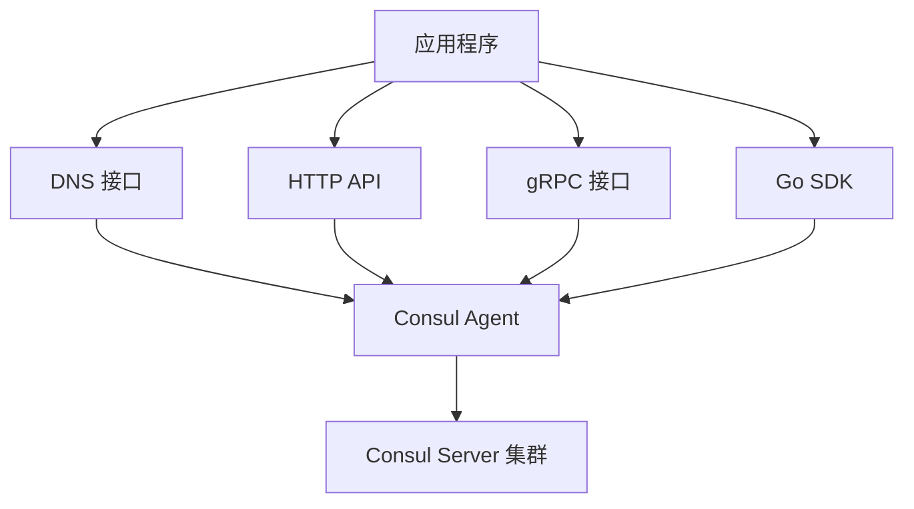

# Consul 项目问题与解决方案分析

## 项目概述

Consul 是 HashiCorp 开发的分布式、高可用、数据中心感知的服务网络解决方案。它为动态分布式基础设施中的应用程序连接和配置提供了完整的解决方案。

## 核心解决的问题

### 1. 微服务架构中的服务发现难题

#### 问题背景
在传统的单体应用架构中，服务间通信相对简单，因为所有组件都运行在同一个进程中。但随着微服务架构的兴起，出现了以下挑战：

- **动态 IP 地址管理**: 容器化和云环境中，服务实例的 IP 地址经常变化
- **服务实例数量变化**: 自动扩缩容导致服务实例数量动态变化
- **服务位置发现**: 客户端需要知道如何找到和连接到服务实例
- **负载均衡**: 需要在多个服务实例之间分配请求

#### Consul 的解决方案

**服务注册机制**
```go
// 位置: agent/consul/catalog_endpoint.go
func (c *Catalog) Register(args *structs.RegisterRequest, reply *struct{}) error {
    // 注册服务和健康检查，如果节点不存在则创建节点
    // 支持节点、服务、检查的统一注册
}
```

**DNS 接口服务发现**
- **位置**: `agent/dns.go`
- **功能**: 通过标准 DNS 查询发现服务
- **支持记录类型**: A、AAAA、CNAME、SRV、PTR 记录
- **优势**: 与现有应用无缝集成，无需修改应用代码

**HTTP API 接口**
- **位置**: `agent/http.go`
- **功能**: RESTful API 接口
- **端点**: 服务注册、健康检查、KV 操作等

### 2. 分布式系统中的健康检查与故障检测

#### 问题背景
在分布式环境中，服务实例可能因为各种原因变得不可用：
- 网络分区
- 服务崩溃
- 资源耗尽
- 配置错误

传统的负载均衡器无法及时检测到这些问题，导致请求被路由到不健康的实例。

#### Consul 的解决方案

**多层次健康检查**
```go
// 位置: agent/health_endpoint.go
func (s *HTTPHandlers) HealthNodeChecks(resp http.ResponseWriter, req *http.Request) (interface{}, error) {
    // 节点级别健康检查
}

func (s *HTTPHandlers) HealthServiceChecks(resp http.ResponseWriter, req *http.Request) (interface{}, error) {
    // 服务级别健康检查
}
```

**健康检查类型**:
- **HTTP 检查**: 定期发送 HTTP 请求验证服务状态
- **TCP 检查**: 验证端口连通性
- **脚本检查**: 执行自定义脚本验证服务状态
- **TTL 检查**: 服务主动报告健康状态

**自动故障检测和恢复**:
- 实时监控服务健康状态
- 自动将不健康的实例从服务发现中移除
- 服务恢复后自动重新加入

### 3. 配置管理的动态性挑战

#### 问题背景
传统的配置管理工具（如 Chef、Puppet）主要关注静态配置：
- 配置更新需要重新部署
- 无法根据系统状态动态调整配置
- 多数据中心配置同步复杂
- 配置变更的一致性难以保证

#### Consul 的解决方案

**分布式键值存储**
```go
// 位置: agent/consul/state/kvs.go
// 功能: 键值存储，支持锁定、TTL、墓碑机制
```

**KV 存储特性**:
- **强一致性**: 基于 Raft 算法保证数据一致性
- **分层存储**: 支持目录结构的键值组织
- **原子操作**: 支持 CAS（Compare-And-Swap）操作
- **监听机制**: 配置变更时实时通知应用

**动态配置更新**:
- 应用可以实时监听配置变更
- 无需重启即可应用新配置
- 支持配置回滚和版本管理

### 4. 多数据中心部署的复杂性

#### 问题背景
现代应用通常需要部署在多个数据中心以实现：
- 高可用性
- 灾难恢复
- 就近服务
- 合规要求

但多数据中心部署面临挑战：
- 网络延迟和分区
- 数据一致性
- 跨数据中心服务发现
- 配置同步

#### Consul 的解决方案

**WAN 联邦架构**
```go
// 位置: agent/consul/config.go
type Config struct {
    // SerfWANConfig 是跨数据中心 serf 的配置
    SerfWANConfig *serf.Config
    
    // SerfLANConfig 是数据中心内 serf 的配置  
    SerfLANConfig *serf.Config
}
```

**多数据中心特性**:
- **数据中心感知**: 自动识别和管理多个数据中心
- **跨数据中心服务发现**: 可以发现其他数据中心的服务
- **智能路由**: 优先使用本地数据中心的服务
- **故障转移**: 本地数据中心不可用时自动切换

### 5. 分布式锁和协调问题

#### 问题背景
分布式系统中经常需要：
- 确保某个操作只在一个节点上执行
- 协调多个节点的操作顺序
- 实现分布式互斥
- 管理共享资源的访问

#### Consul 的解决方案

**分布式锁实现**
```go
// 位置: command/lock/lock.go
func (c *cmd) setupLock(client *api.Client, prefix, name string,
    oneshot bool, wait time.Duration, retry int) (*LockUnlock, error) {
    // 设置分布式锁
    opts := api.LockOptions{
        Key:              key,
        SessionName:      name,
        MonitorRetries:   retry,
        MonitorRetryTime: defaultMonitorRetryTime,
    }
}
```

**信号量支持**:
- 支持分布式信号量
- 限制同时访问资源的节点数量
- 自动故障检测和锁释放

### 6. 服务间安全通信

#### 问题背景
微服务架构中的安全挑战：
- 服务间通信加密
- 身份验证和授权
- 证书管理
- 网络安全策略

#### Consul 的解决方案

**服务网格 (Connect)**
```go
// 位置: docs/service-mesh/README.md
// 提供安全的服务间通信，支持自动 TLS 加密和基于身份的授权
```

**安全特性**:
- **自动 TLS**: 自动为服务生成和轮换 TLS 证书
- **基于身份的授权**: 使用服务身份而非网络位置进行授权
- **意图策略**: 声明式的服务间通信策略
- **证书管理**: 自动化的证书生命周期管理

## 技术架构解决方案

### 1. 一致性保证 - Raft 共识算法

#### 问题
分布式系统中的数据一致性是一个根本性挑战，特别是在网络分区和节点故障的情况下。

#### 解决方案
```go
// 位置: agent/consul/raft_*.go
// 实现: 基于 Raft 算法的强一致性保证
```

**Raft 算法优势**:
- **强一致性**: 保证所有节点看到相同的数据
- **分区容错**: 在网络分区时仍能正常工作
- **领导者选举**: 自动选举和故障转移
- **日志复制**: 确保操作的持久性和一致性

### 2. 高可用性 - 多层故障检测

#### 问题
单点故障会导致整个系统不可用。

#### 解决方案
```go
// 位置: agent/consul/server_ce.go
func (s *Server) reconcile() (err error) {
    // 协调 Serf 成员关系和强一致性存储之间的差异
    // 确保所有活跃节点都已注册，所有失败节点都被标记
}
```

**多层保护**:
- **Serf 集群管理**: 快速故障检测
- **Raft 共识**: 数据一致性保证
- **健康检查**: 应用级别的健康监控
- **自动恢复**: 故障节点恢复后自动重新加入

### 3. 可扩展性 - 分层架构设计

#### 问题
随着系统规模增长，需要支持更多的服务和节点。

#### 解决方案
```go
// 位置: agent/consul/server.go
type Server struct {
    // 管理服务发现、健康检查、DC 转发、Raft 和多个 Serf 池
}

// 位置: agent/consul/client.go  
type Client struct {
    // 使用 RPC 与服务器通信，处理服务发现、健康检查和数据中心转发
}
```

**架构优势**:
- **客户端-服务器模式**: 分离控制平面和数据平面
- **连接池**: 高效的网络连接管理
- **负载均衡**: 智能的服务器选择
- **缓存机制**: 减少网络开销

## 实际应用场景

### 1. 微服务架构迁移
- **问题**: 从单体应用迁移到微服务架构
- **解决**: 提供服务发现、配置管理、健康检查的完整解决方案

### 2. 云原生应用部署
- **问题**: 容器化应用的动态性和复杂性
- **解决**: 与 Kubernetes、Docker 等容器平台集成

### 3. 混合云和多云部署
- **问题**: 跨云服务商的服务发现和配置管理
- **解决**: 统一的服务发现和配置管理平面

### 4. 传统应用现代化
- **问题**: 传统应用需要逐步现代化
- **解决**: 通过 DNS 接口无缝集成，无需修改应用代码

## 核心技术优势

### 1. 多协议支持
Consul 提供多种接口协议，满足不同应用的需求：



### 2. 数据一致性模型
Consul 提供三种一致性级别，平衡性能和一致性需求：

- **default**: 基于领导者租约，快速读取但可能短暂不一致
- **consistent**: 强一致性，需要额外的仲裁验证
- **stale**: 允许从任何服务器读取，最快但可能不一致

### 3. 反熵机制
```go
// 位置: agent/consul/server_ce.go
func (s *Server) reconcile() (err error) {
    // 反熵机制协调本地状态和全局状态
    // 确保系统在故障后能够自动恢复一致性
}
```

反熵机制确保：
- 本地代理状态与全局目录同步
- 故障节点的自动清理
- 网络分区恢复后的状态协调

## 与其他解决方案的对比

### 1. vs 传统配置管理工具 (Chef/Puppet)
- **动态性**: Consul 支持实时配置更新，传统工具需要定期收敛
- **状态感知**: Consul 可以根据系统状态调整配置
- **多数据中心**: Consul 原生支持，传统工具需要复杂配置

### 2. vs 其他服务发现工具 (Etcd/Zookeeper)
- **健康检查**: Consul 内置多种健康检查机制
- **多数据中心**: 原生支持跨数据中心部署
- **DNS 接口**: 提供标准 DNS 接口，无需修改应用代码
- **服务网格**: 集成 Connect 服务网格功能

### 3. vs 云服务商解决方案
- **厂商中立**: 不绑定特定云服务商
- **混合云支持**: 统一管理本地和云端资源
- **开源透明**: 完全开源，可自主控制

## 总结

Consul 通过以下核心技术解决了分布式系统中的关键问题：

1. **服务发现**: 解决了微服务架构中的服务定位问题
2. **健康检查**: 提供了可靠的故障检测和自动恢复机制  
3. **配置管理**: 实现了动态、一致的配置管理
4. **多数据中心**: 简化了多数据中心部署的复杂性
5. **安全通信**: 提供了完整的服务网格安全解决方案
6. **分布式协调**: 支持分布式锁和协调原语

这些解决方案使得 Consul 成为了现代分布式系统和微服务架构的重要基础设施组件，为构建可靠、可扩展、安全的分布式应用提供了坚实的基础。

## 源代码架构映射

```
consul/
├── agent/                 # 核心代理实现
│   ├── consul/            # 服务器和客户端实现
│   │   ├── server.go      # 服务器核心逻辑
│   │   ├── client.go      # 客户端实现
│   │   ├── catalog_endpoint.go  # 服务注册
│   │   └── health_endpoint.go   # 健康检查
│   ├── dns.go             # DNS 接口实现
│   └── http.go            # HTTP API 实现
├── api/                   # Go 客户端 SDK
├── command/               # CLI 命令实现
│   └── lock/              # 分布式锁命令
├── connect/               # 服务网格实现
├── acl/                   # 访问控制列表
└── docs/                  # 开发者文档
```

通过这种分层架构设计，Consul 实现了高度模块化和可扩展的分布式服务管理平台。
