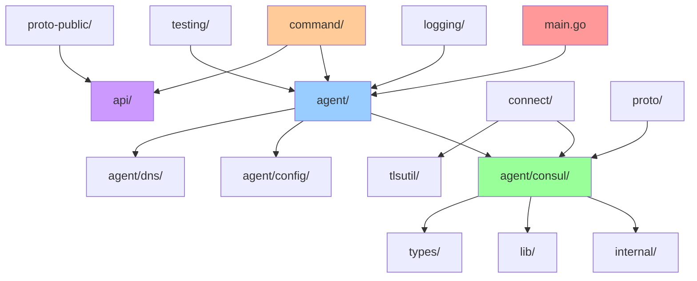

# Consul 项目文件结构详解

## 概述

本文档详细分析 HashiCorp Consul 项目的文件结构组织，从数据库架构师的角度解读各个模块的职责、依赖关系和设计模式。

## 项目根目录结构

```
consul/
├── main.go                    # 主入口文件
├── go.mod                     # Go 模块依赖管理
├── go.sum                     # 依赖校验和
├── Makefile                   # 构建脚本
├── Dockerfile                 # 容器化构建文件
├── LICENSE                    # 开源许可证
├── README.md                  # 项目说明文档
├── CHANGELOG.md               # 版本变更日志
└── package-lock.json          # 前端依赖锁定文件
```

## 核心模块架构

### 1. Agent 模块 (`/agent`)

**作用**: Consul 的核心代理程序，负责服务发现、健康检查、配置管理等核心功能。

```
agent/
├── agent.go                   # Agent 主要逻辑和生命周期管理
├── agent_endpoint.go          # Agent HTTP API 端点处理
├── catalog_endpoint.go        # 服务目录 API 端点
├── config/                    # 配置管理模块
├── consul/                    # Consul 服务器核心逻辑
│   ├── server.go             # Consul 服务器实现
│   ├── client.go             # Consul 客户端实现
│   ├── fsm/                  # 有限状态机 (Raft FSM)
│   ├── state/                # 状态存储和管理
│   └── catalog_endpoint.go   # 服务目录 RPC 端点
├── dns/                      # DNS 接口实现
├── http.go                   # HTTP 服务器和路由
├── local/                    # 本地状态管理
├── proxycfg/                 # 代理配置管理
├── cache/                    # 缓存系统
├── checks/                   # 健康检查实现
└── structs/                  # 数据结构定义
```

**关键文件分析**:
- `agent.go`: Agent 的主要控制器，管理服务生命周期
- `consul/server.go`: Consul 服务器核心，处理 Raft 共识、状态管理
- `consul/client.go`: Consul 客户端，处理与服务器的 RPC 通信
- `consul/fsm/`: 实现 Raft 有限状态机，确保集群状态一致性

### 2. API 客户端模块 (`/api`)

**作用**: 提供 Go 语言的 Consul API 客户端库，供外部应用程序集成使用。

```
api/
├── api.go                     # API 客户端核心实现
├── agent.go                   # Agent API 接口
├── catalog.go                 # 服务目录 API 接口
├── health.go                  # 健康检查 API 接口
├── kv.go                      # 键值存储 API 接口
├── session.go                 # 会话管理 API 接口
├── connect.go                 # Service Mesh 连接 API
├── config_entry.go            # 配置条目 API
├── go.mod                     # 独立的 Go 模块
└── README.md                  # API 使用文档
```

**设计特点**:
- 独立的 Go 模块，可单独引用
- 提供完整的 Consul HTTP API 封装
- 支持所有 Consul 功能的编程接口

### 3. 命令行工具模块 (`/command`)

**作用**: 实现 `consul` 命令行工具的所有子命令。

```
command/
├── registry.go                # 命令注册中心
├── agent/                     # consul agent 命令
├── acl/                       # ACL 权限管理命令
├── catalog/                   # 服务目录操作命令
├── config/                    # 配置管理命令
├── connect/                   # Service Mesh 相关命令
├── kv/                        # 键值存储操作命令
├── members/                   # 集群成员管理命令
├── services/                  # 服务管理命令
├── snapshot/                  # 快照管理命令
└── version/                   # 版本信息命令
```

**架构模式**:
- 使用命令注册模式，统一管理所有子命令
- 每个子命令独立实现，支持插件化扩展
- 统一的错误处理和用户界面

### 4. Service Mesh 模块 (`/connect`)

**作用**: 实现 Consul Connect 服务网格功能。

```
connect/
├── service.go                 # Service Mesh 服务抽象
├── tls.go                     # TLS 证书管理
├── resolver.go                # 服务解析器
├── proxy/                     # 内置代理实现
├── certgen/                   # 证书生成工具
└── testing.go                 # 测试工具
```

**核心功能**:
- 服务间安全通信
- 自动 TLS 证书管理
- 服务发现和负载均衡
- 代理配置管理

### 5. 内部模块 (`/internal`)

**作用**: 内部共享组件和工具库。

```
internal/
├── controller/                # 控制器框架 (类似 Kubernetes Controller)
├── resource/                  # 资源管理系统
├── storage/                   # 存储抽象层
├── multicluster/              # 多集群管理
├── gossip/                    # Gossip 协议实现
├── dnsutil/                   # DNS 工具
├── protoutil/                 # Protobuf 工具
└── testing/                   # 测试工具集
```

**设计理念**:
- 内部 API，不对外暴露
- 提供可复用的基础组件
- 支持企业版功能扩展

### 6. 协议定义模块 (`/proto` 和 `/proto-public`)

**作用**: 定义 gRPC 协议和数据结构。

```
proto/                         # 内部协议定义
├── private/                   # 私有协议 (集群内部通信)
├── buf.yaml                   # Protocol Buffers 配置
└── buf.gen.yaml              # 代码生成配置

proto-public/                  # 公开协议定义
├── pbresource/               # 资源管理协议
├── pbdataplane/              # 数据平面协议
├── pbconnectca/              # Connect CA 协议
├── pbacl/                    # ACL 协议
└── go.mod                    # 独立模块
```

**协议分层**:
- `proto-public`: 对外公开的 API 协议
- `proto/private`: 集群内部通信协议
- 使用 Protocol Buffers 确保向后兼容

## 支撑模块

### 7. 工具库模块 (`/lib`)

**作用**: 提供通用工具函数和数据结构。

```
lib/
├── channels/                  # 通道工具
├── maps/                      # Map 操作工具
├── retry/                     # 重试机制
├── semaphore/                 # 信号量实现
├── ttlcache/                  # TTL 缓存
├── template/                  # 模板引擎
└── testhelpers/               # 测试辅助工具
```

### 8. 类型定义模块 (`/types`)

**作用**: 定义核心数据类型。

```
types/
├── node_id.go                 # 节点 ID 类型
├── checks.go                  # 健康检查类型
├── area.go                    # 网络区域类型
└── tls.go                     # TLS 配置类型
```

### 9. 日志模块 (`/logging`)

**作用**: 统一的日志管理系统。

```
logging/
├── logger.go                  # 日志器实现
├── logfile.go                 # 日志文件管理
├── monitor/                   # 日志监控
├── grpc.go                    # gRPC 日志集成
└── syslog.go                  # 系统日志集成
```

### 10. TLS 工具模块 (`/tlsutil`)

**作用**: TLS 证书管理和配置。

```
tlsutil/
├── config.go                  # TLS 配置管理
├── generate.go                # 证书生成
└── mock.go                    # 测试模拟
```

## 测试和文档

### 11. 测试模块

```
test/                          # 单元测试
test-integ/                    # 集成测试
testing/                       # 测试框架
testrpc/                       # RPC 测试工具
sdk/testutil/                  # SDK 测试工具
```

### 12. 文档模块

```
docs/                          # 技术文档
website/                       # 官方网站
docz/                          # 自定义技术文档 (本项目添加)
```

### 13. 前端模块

```
ui/                            # Web UI 界面
├── packages/                  # 前端包管理
├── package.json              # Node.js 依赖
└── yarn.lock                 # 依赖锁定
```

## 构建和部署

### 14. 构建支持

```
build-support/                 # 构建脚本和工具
├── docker/                   # Docker 构建文件
├── scripts/                  # 构建脚本
└── functions/                # 构建函数库
```

### 15. 版本管理

```
version/
├── version.go                # 版本信息
├── VERSION                   # 版本号文件
└── fips.go                   # FIPS 合规性
```

## 模块依赖关系



## 设计模式分析

### 1. 分层架构模式
- **表示层**: HTTP API、DNS、CLI
- **业务层**: Agent、Consul Server/Client
- **数据层**: FSM、State Store

### 2. 插件化架构
- 命令行工具支持插件扩展
- 健康检查支持多种类型
- 配置条目支持多种格式

### 3. 事件驱动架构
- Gossip 协议事件传播
- 状态变更事件通知
- 健康检查状态变更

### 4. 微服务架构
- 独立的 API 客户端模块
- 可插拔的组件设计
- 服务网格支持

## 总结

Consul 项目采用了清晰的模块化架构设计：

1. **核心分离**: Agent 和 API 客户端分离，支持独立使用
2. **协议分层**: 内部协议和公开协议分离，确保 API 稳定性
3. **功能模块化**: 每个功能模块独立，支持插件化扩展
4. **测试完备**: 完整的测试框架和工具支持
5. **文档齐全**: 技术文档和用户文档并重

这种架构设计确保了 Consul 的可维护性、可扩展性和稳定性，是大型分布式系统项目的优秀实践。

## 详细模块分析

### Agent 模块深度解析

#### 核心组件

**1. Agent 生命周期管理** (`agent/agent.go`)
```go
// 代码位置: agent/agent.go:174
type Agent struct {
    config         *config.RuntimeConfig
    logger         hclog.InterceptLogger
    delegate       delegate
    State          *local.State
    sync           *ae.StateSyncer
    checkReapAfter map[types.CheckID]time.Duration
    checkMonitors  map[types.CheckID]*checks.CheckMonitor
    checkTTLs      map[types.CheckID]*checks.CheckTTL
    // ... 更多字段
}
```

**职责**:
- 管理本地服务和健康检查
- 协调本地状态与集群状态同步
- 处理配置变更和重载
- 管理各种检查类型的生命周期

**2. Consul 服务器核心** (`agent/consul/server.go`)
```go
// 代码位置: agent/consul/server.go:174
type Server struct {
    config         *Config
    logger         hclog.InterceptLogger
    raft           *raft.Raft
    fsm            *fsm.FSM
    rpcServer      *rpc.Server
    // ... 更多字段
}
```

**职责**:
- Raft 共识算法实现
- 集群状态管理
- RPC 服务处理
- Leader 选举和故障转移

#### 状态管理子系统

**1. 本地状态管理** (`agent/local/state.go`)
- **反熵同步**: 确保本地状态与集群状态一致
- **状态缓存**: 提高查询性能
- **变更检测**: 监控状态变化并触发同步

**2. 集群状态存储** (`agent/consul/state/`)
- **MemDB**: 内存数据库，支持事务和索引
- **状态快照**: 支持 Raft 快照和恢复
- **索引管理**: 多维度索引支持高效查询

#### 网络通信层

**1. HTTP API 服务器** (`agent/http.go`)
```go
// 代码位置: agent/http.go:94
type HTTPHandlers struct {
    agent           *Agent
    denylist        *Denylist
    configReloaders []ConfigReloader
    h               http.Handler
}
```

**2. DNS 服务器** (`agent/dns.go`)
- 提供 DNS 接口的服务发现
- 支持 SRV 记录和 A/AAAA 记录
- 递归查询和缓存

**3. gRPC 服务器** (`agent/grpc-external/`, `agent/grpc-internal/`)
- 外部 gRPC API (数据平面通信)
- 内部 gRPC API (集群内通信)
- 流式 API 支持

### API 客户端模块深度解析

#### 客户端架构

**1. 核心客户端** (`api/api.go`)
```go
// 代码位置: api/api.go:347
type Config struct {
    Address    string
    Scheme     string
    Datacenter string
    Transport  *http.Transport
    HttpClient *http.Client
    // ... 更多配置
}
```

**2. 功能模块**
- **服务目录** (`api/catalog.go`): 服务注册和发现
- **健康检查** (`api/health.go`): 健康状态查询
- **键值存储** (`api/kv.go`): 分布式配置存储
- **会话管理** (`api/session.go`): 分布式锁和领导选举
- **ACL 管理** (`api/acl.go`): 访问控制列表

#### 设计特点

**1. 独立模块设计**
- 独立的 `go.mod` 文件
- 最小化依赖
- 向后兼容保证

**2. 统一的错误处理**
```go
// 统一的 API 响应结构
type QueryMeta struct {
    LastIndex   uint64
    LastContact time.Duration
    KnownLeader bool
}
```

### 命令行工具模块深度解析

#### 命令注册系统

**1. 命令注册中心** (`command/registry.go`)
```go
// 代码位置: command/registry.go:156
func RegisteredCommands(ui cli.Ui) map[string]mcli.CommandFactory {
    registry := map[string]mcli.CommandFactory{}
    registerCommands(ui, registry,
        entry{"acl", func(cli.Ui) (cli.Command, error) { return acl.New(), nil }},
        entry{"agent", func(ui cli.Ui) (cli.Command, error) { return agent.New(ui), nil }},
        // ... 更多命令
    )
    return registry
}
```

**2. 命令实现模式**
- 统一的命令接口
- 标准化的参数解析
- 一致的错误处理和输出格式

#### 主要命令分类

**1. 集群管理命令**
- `consul agent`: 启动 Consul 代理
- `consul members`: 查看集群成员
- `consul join`: 加入集群
- `consul leave`: 离开集群

**2. 服务管理命令**
- `consul services`: 服务管理
- `consul catalog`: 服务目录操作
- `consul health`: 健康检查

**3. 配置管理命令**
- `consul config`: 配置条目管理
- `consul kv`: 键值存储操作
- `consul acl`: 访问控制管理

### Service Mesh 模块深度解析

#### Connect 架构

**1. 服务抽象** (`connect/service.go`)
```go
// 代码位置: connect/service.go:184
func (s *Service) Dial(ctx context.Context, resolver Resolver) (net.Conn, error) {
    addr, certURI, err := resolver.Resolve(ctx)
    if err != nil {
        return nil, err
    }
    // TLS 连接建立和证书验证
}
```

**2. 证书管理** (`connect/tls.go`)
- 自动证书轮换
- 证书验证和信任链
- SPIFFE 身份标准支持

**3. 代理实现** (`connect/proxy/`)
- 内置代理实现
- Envoy 集成支持
- 流量拦截和路由

#### CA 证书管理

**1. CA 提供者接口**
- Consul 内置 CA
- Vault CA 集成
- AWS ACM 集成

**2. 证书生命周期**
- 自动签发和续期
- 证书撤销和轮换
- 根证书管理

### 协议定义模块深度解析

#### Protocol Buffers 架构

**1. 公开协议** (`proto-public/`)
```
proto-public/
├── pbresource/          # 资源管理 API
├── pbdataplane/         # 数据平面 API
├── pbconnectca/         # Connect CA API
├── pbacl/              # ACL API
└── pbdns/              # DNS API
```

**2. 私有协议** (`proto/private/`)
- 集群内部通信协议
- Raft 日志条目定义
- 内部状态同步协议

#### 代码生成

**1. 生成配置** (`buf.gen.yaml`)
```yaml
version: v1
plugins:
  - plugin: buf.build/protocolbuffers/go
    out: .
    opt: paths=source_relative
  - plugin: buf.build/grpc/go
    out: .
    opt: paths=source_relative
```

**2. 向后兼容性**
- 字段编号管理
- 废弃字段处理
- 版本演进策略

## 企业版架构扩展

### 企业版模块

**1. 命名空间支持**
- 多租户隔离
- 资源配额管理
- 权限边界控制

**2. 网络分段**
- 网络区域划分
- 跨区域通信控制
- 性能优化

**3. 审计日志**
- 操作审计记录
- 合规性支持
- 安全事件监控

### 扩展点设计

**1. 接口抽象**
```go
// 企业版功能接口
type EnterpriseFeature interface {
    Initialize() error
    Validate() error
    Apply() error
}
```

**2. 编译时特性**
- 构建标签控制
- 条件编译
- 功能开关

## 性能优化设计

### 缓存系统

**1. 多层缓存架构** (`agent/cache/`)
- L1: 内存缓存
- L2: 本地磁盘缓存
- L3: 分布式缓存

**2. 缓存策略**
- TTL 过期策略
- LRU 淘汰算法
- 缓存预热机制

### 并发控制

**1. 读写分离**
- 读操作优化
- 写操作批处理
- 并发控制机制

**2. 连接池管理**
- RPC 连接池
- HTTP 连接复用
- gRPC 连接管理

## 监控和可观测性

### 指标收集

**1. 内置指标** (`agent/metrics/`)
- 性能指标
- 业务指标
- 系统指标

**2. 指标导出**
- Prometheus 格式
- StatsD 协议
- 自定义格式

### 日志系统

**1. 结构化日志** (`logging/`)
- JSON 格式输出
- 日志级别控制
- 上下文信息

**2. 日志聚合**
- 集中式日志收集
- 日志轮转管理
- 远程日志传输

### 分布式追踪

**1. 追踪集成**
- OpenTracing 支持
- Jaeger 集成
- 请求链路追踪

**2. 性能分析**
- CPU 性能分析
- 内存使用分析
- 网络延迟分析
