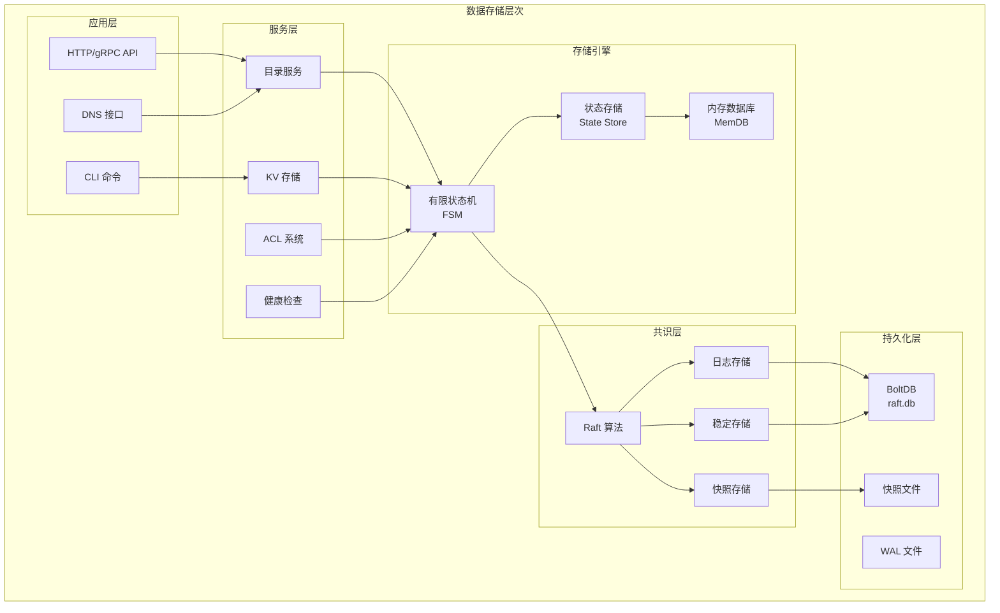
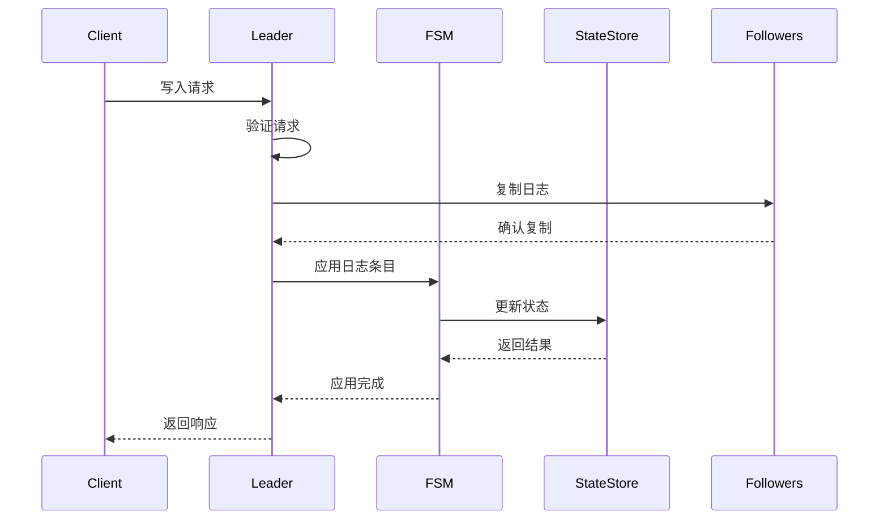
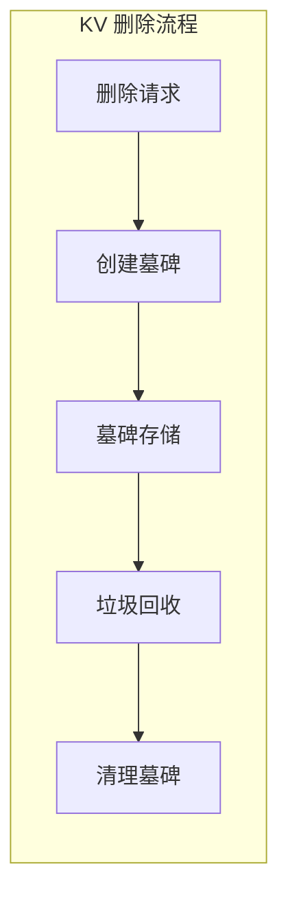
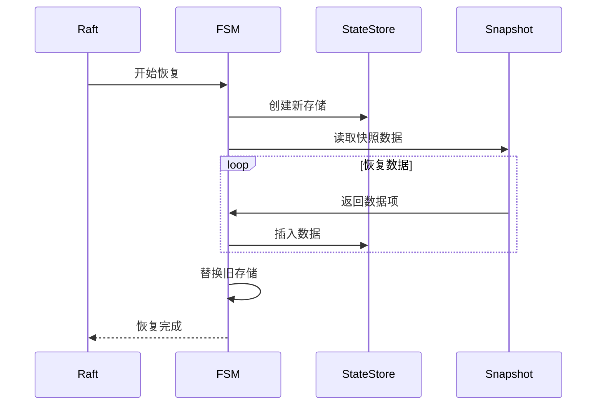

# Consul 数据存储架构

## 概述

Consul 的数据存储架构基于 Raft 共识算法，提供强一致性保证。所有数据都存储在内存中，通过 Raft 日志和有限状态机 (FSM) 来保证数据的持久性和一致性。

## 核心组件架构



## 1. Raft 共识算法实现

### 核心文件位置
- `agent/consul/server.go` - Raft 初始化和管理
- `agent/consul/raft_*.go` - Raft 相关实现
- `agent/consul/fsm/fsm.go` - 有限状态机

### Raft 组件详解

#### 1.1 日志存储 (LogStore)
```go
// 位置: agent/consul/server.go:987-1083
var log raft.LogStore
if s.config.DevMode {
    // 开发模式使用内存存储
    store := raft.NewInmemStore()
    log = store
} else {
    // 生产模式使用 BoltDB
    boltDBFile := filepath.Join(path, "raft.db")
    store, err := raftboltdb.NewBoltStore(boltDBFile)
    log = store
}
```

**功能特性**:
- 存储 Raft 日志条目
- 支持日志验证 (可选)
- 日志缓存优化性能
- 持久化到 BoltDB

#### 1.2 稳定存储 (StableStore)
```go
// 存储 Raft 元数据
type StableStore interface {
    Set(key []byte, val []byte) error
    Get(key []byte) ([]byte, error)
    SetUint64(key []byte, val uint64) error
    GetUint64(key []byte) (uint64, error)
}
```

**存储内容**:
- 当前任期 (CurrentTerm)
- 投票记录 (VotedFor)
- 集群配置信息

#### 1.3 快照存储 (SnapshotStore)
```go
// 位置: agent/consul/server.go:1085-1090
snapshots, err := raft.NewFileSnapshotStoreWithLogger(
    path, snapshotsRetained, s.logger.Named("raft.snapshot"))
```

**功能**:
- 定期创建状态快照
- 快速恢复大量数据
- 减少日志重放时间
- 支持增量快照

## 2. 有限状态机 (FSM) 架构

### FSM 核心结构
```go
// 位置: agent/consul/fsm/fsm.go:51-68
type FSM struct {
    deps    Deps
    logger  hclog.Logger
    chunker *raftchunking.ChunkingFSM
    
    // 命令路由映射
    apply map[structs.MessageType]command
    
    // 状态锁和存储
    stateLock sync.RWMutex
    state     *state.Store
    
    publisher *stream.EventPublisher
}
```

### 命令处理机制

#### 2.1 命令类型
- `RegisterRequest` - 节点/服务注册
- `DeregisterRequest` - 节点/服务注销
- `KVSRequest` - KV 操作
- `SessionRequest` - 会话管理
- `ACLRequest` - ACL 操作
- `TombstoneRequest` - 墓碑清理

#### 2.2 状态变更流程


## 3. 状态存储 (State Store) 设计

### 核心结构
```go
// 位置: agent/consul/state/state_store.go:105-118
type Store struct {
    schema *memdb.DBSchema
    db     *changeTrackerDB
    
    // 放弃通道，用于通知观察者
    abandonCh chan struct{}
    
    // KV 墓碑管理
    kvsGraveyard *Graveyard
    
    // 锁延迟管理
    lockDelay *Delay
}
```

### 数据表结构

#### 3.1 节点表 (Nodes)
- **主键**: Node ID
- **索引**: Node Name, Meta
- **内容**: 节点信息、地址、元数据

#### 3.2 服务表 (Services)
- **主键**: Node + Service ID
- **索引**: Service Name, Kind, Connect
- **内容**: 服务定义、端口、标签

#### 3.3 检查表 (Checks)
- **主键**: Node + Check ID
- **索引**: Status, Service, Node
- **内容**: 健康检查状态和结果

#### 3.4 KV 表 (KVS)
- **主键**: Key
- **索引**: Key Prefix
- **内容**: 键值对、元数据、锁信息

### 事务处理机制

#### 3.1 读事务
```go
// 位置: agent/consul/state/state_store.go
tx := s.db.Txn(false) // 只读事务
defer tx.Abort()
```

#### 3.2 写事务
```go
// 位置: agent/consul/state/state_store.go
tx := s.db.WriteTxn(idx) // 写事务
defer tx.Abort()
// ... 执行操作
return tx.Commit()
```

## 4. KV 存储详细设计

### 核心功能
```go
// 位置: agent/consul/state/kvs.go
func (s *Store) KVSSet(idx uint64, entry *structs.DirEntry) error
func (s *Store) KVSGet(ws memdb.WatchSet, key string, entMeta *acl.EnterpriseMeta) (uint64, *structs.DirEntry, error)
func (s *Store) KVSDelete(idx uint64, key string, entMeta *acl.EnterpriseMeta) error
```

### 墓碑机制


**墓碑作用**:
- 防止索引回退
- 支持删除操作的复制
- 延迟清理机制
- 保证一致性

### 锁机制
```go
// 位置: agent/consul/state/kvs.go:411-422
func (s *Store) KVSLock(idx uint64, entry *structs.DirEntry) (bool, error) {
    tx := s.db.WriteTxn(idx)
    defer tx.Abort()
    
    locked, err := kvsLockTxn(tx, idx, entry)
    if !locked || err != nil {
        return false, err
    }
    
    err = tx.Commit()
    return err == nil, err
}
```

## 5. 快照和恢复机制

### 快照创建
```go
// FSM 快照接口
func (c *FSM) Snapshot() (raft.FSMSnapshot, error) {
    defer func(start time.Time) {
        c.logger.Info("snapshot created", "duration", time.Since(start))
    }(time.Now())
    
    return &snapshot{c.state.Snapshot()}, nil
}
```

### 快照内容
- 所有节点信息
- 服务注册数据
- 健康检查状态
- KV 存储数据
- ACL 策略和令牌
- 会话信息

### 恢复流程


## 6. 性能优化策略

### 6.1 内存优化
- 使用 MemDB 进行高效内存访问
- 索引优化减少查询时间
- 对象池减少 GC 压力

### 6.2 I/O 优化
- 批量写入减少磁盘操作
- 日志缓存提高写入性能
- 异步快照避免阻塞

### 6.3 网络优化
- 日志压缩减少网络传输
- 批量复制提高效率
- 管道化处理并发请求

## 7. 监控和调试

### 关键指标
- Raft 日志条目数量
- 快照创建频率
- 状态存储大小
- 事务处理延迟

### 调试工具
- Raft 状态查询
- 快照内容检查
- 日志条目分析
- 性能分析接口

这个数据存储架构确保了 Consul 的高可用性、强一致性和高性能，为分布式服务发现和配置管理提供了可靠的基础。
