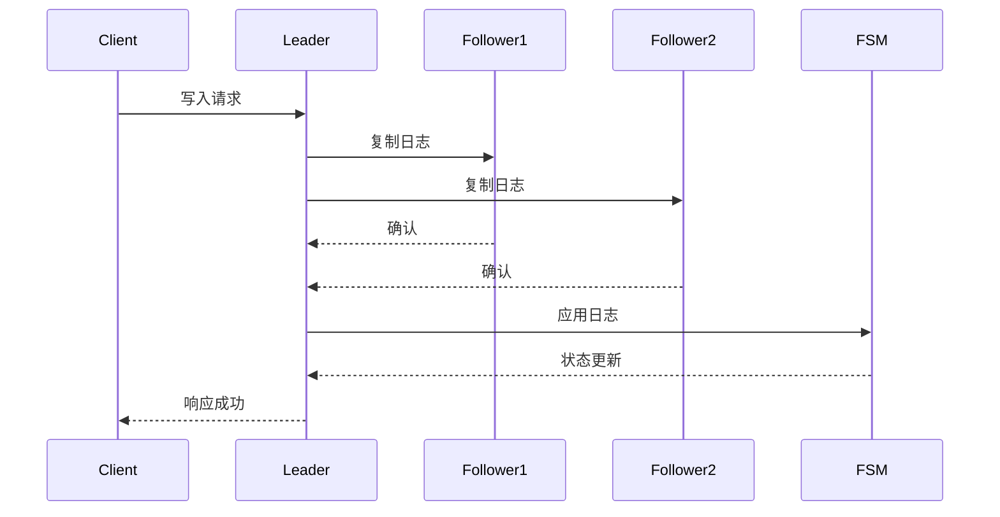
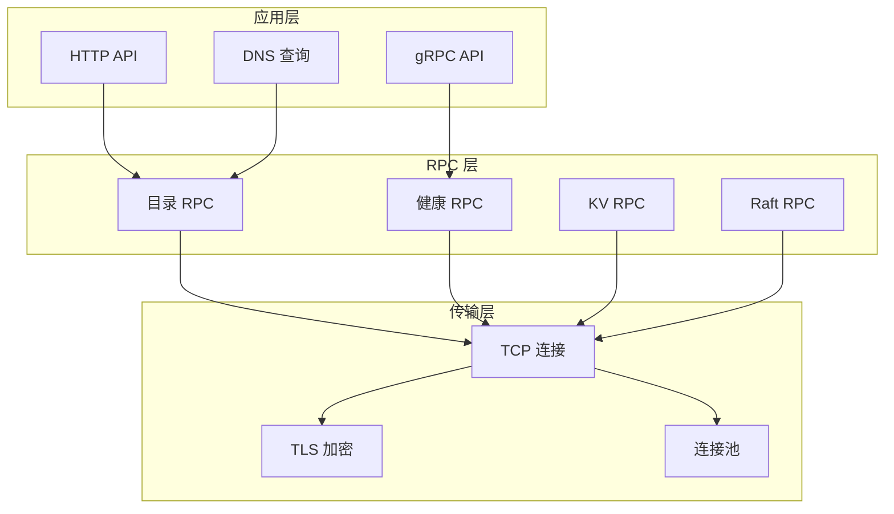
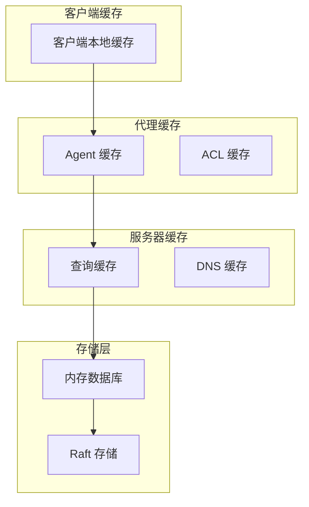

# Consul 架构设计模式分析

## 概述

本文档从高级数据库架构师的角度分析 Consul 中使用的核心设计模式，结合源代码实现深入探讨这些模式如何确保系统的可靠性、可扩展性和高性能。

## 1. 分布式系统设计模式

### 1.1 领导者选举模式 (Leader Election Pattern)

#### 实现机制
- **算法**: Raft 共识算法
- **位置**: `agent/consul/server.go:1178-1188`

```go
// Raft 配置和启动
s.raft, err = raft.NewRaft(s.config.RaftConfig, s.fsm.ChunkingFSM(), log, stable, snap, trans)
```

#### 设计优势
- **强一致性**: 确保集群中只有一个领导者
- **自动故障转移**: 领导者故障时自动选举新领导者
- **分区容错**: 网络分区时保持可用性

#### 应用场景
- 写操作协调
- 集群状态管理
- 配置变更控制

### 1.2 状态机复制模式 (State Machine Replication)

#### 核心组件
- **FSM**: `agent/consul/fsm/fsm.go:51-68`
- **日志复制**: Raft 日志机制

```go
type FSM struct {
    deps    Deps
    logger  hclog.Logger
    chunker *raftchunking.ChunkingFSM
    
    // 命令路由映射
    apply map[structs.MessageType]command
    
    // 状态存储
    state *state.Store
}
```

#### 一致性保证


### 1.3 最终一致性模式 (Eventual Consistency)

#### Serf 集群管理
- **位置**: `agent/consul/server.go:344-372`
- **协议**: Gossip 协议

```go
// LAN Serf 用于数据中心内通信
serfLAN *serf.Serf

// WAN Serf 用于跨数据中心通信  
serfWAN *serf.Serf
```

#### 收敛机制
- **反熵**: 定期同步状态差异
- **谣言传播**: 快速传播状态变更
- **故障检测**: 及时发现节点故障

## 2. 数据存储设计模式

### 2.1 CQRS 模式 (Command Query Responsibility Segregation)

#### 读写分离
- **写操作**: 通过 Raft 领导者处理
- **读操作**: 可从任意节点读取

```go
// 写操作必须通过领导者
func (c *Catalog) Register(args *structs.RegisterRequest, reply *struct{}) error {
    if done, err := c.srv.ForwardRPC("Catalog.Register", args, reply); done {
        return err
    }
    // 处理注册逻辑...
}

// 读操作可以本地处理
func (c *Catalog) ListServices(args *structs.DCSpecificRequest, reply *structs.IndexedServices) error {
    // 本地读取服务列表...
}
```

#### 性能优化
- **读取扩展**: 多个副本提供读取服务
- **写入集中**: 单一领导者保证一致性
- **缓存友好**: 读取操作支持缓存

### 2.2 事件溯源模式 (Event Sourcing)

#### Raft 日志作为事件存储
- **位置**: `agent/consul/server.go:987-1090`

```go
// 日志存储配置
if s.config.DevMode {
    store := raft.NewInmemStore()
    log = store
} else {
    boltDBFile := filepath.Join(path, "raft.db")
    store, err := raftboltdb.NewBoltStore(boltDBFile)
    log = store
}
```

#### 事件重放机制
- **快照恢复**: 从快照开始重放
- **增量重放**: 应用新的日志条目
- **状态重建**: 完整重建系统状态

### 2.3 写时复制模式 (Copy-on-Write)

#### 内存数据库实现
- **位置**: `agent/consul/state/state_store.go:105-118`

```go
type Store struct {
    schema *memdb.DBSchema
    db     *changeTrackerDB
    
    // 墓碑管理
    kvsGraveyard *Graveyard
    
    // 锁延迟管理
    lockDelay *Delay
}
```

#### 并发控制
- **读事务**: 不阻塞其他操作
- **写事务**: 原子性更新
- **版本控制**: 支持多版本并发

## 3. 网络通信设计模式

### 3.1 多路复用模式 (Multiplexing Pattern)

#### RPC 连接复用
- **位置**: `agent/consul/raft_rpc.go:20-41`

```go
type RaftLayer struct {
    src     net.Addr
    addr    net.Addr
    connCh  chan net.Conn
    tlsWrap tlsutil.Wrapper
    tlsFunc func(raft.ServerAddress) bool
}
```

#### 协议分层


### 3.2 发布订阅模式 (Publish-Subscribe)

#### 事件流系统
- **位置**: `agent/consul/fsm/fsm.go:67`

```go
type FSM struct {
    // 事件发布器
    publisher *stream.EventPublisher
}
```

#### 事件传播
- **服务变更**: 服务注册/注销事件
- **健康状态**: 健康检查状态变更
- **配置更新**: KV 配置变更事件

### 3.3 断路器模式 (Circuit Breaker Pattern)

#### 健康检查集成
- **位置**: `agent/checks/check.go`

```go
type CheckRunner interface {
    Start()
    Stop()
    UpdateCheck(check types.CheckType, status api.HealthStatus, output string)
}
```

#### 故障隔离
- **服务隔离**: 不健康服务自动隔离
- **快速失败**: 避免级联故障
- **自动恢复**: 服务恢复后自动重新路由

## 4. 缓存设计模式

### 4.1 多级缓存模式 (Multi-Level Caching)

#### 缓存层次


#### 缓存策略
- **TTL**: 基于时间的过期
- **LRU**: 最近最少使用淘汰
- **写穿**: 写操作同时更新缓存

### 4.2 缓存失效模式 (Cache Invalidation)

#### 失效机制
- **位置**: `agent/cache/cache.go`

```go
type Cache struct {
    entries map[string]cacheEntry
    types   map[string]Type
    
    // 统计信息
    requests uint64
    hits     uint64
}
```

#### 失效策略
- **主动失效**: 数据变更时主动清理
- **被动失效**: 访问时检查过期
- **批量失效**: 批量清理相关缓存

## 5. 安全设计模式

### 5.1 基于令牌的认证模式 (Token-Based Authentication)

#### ACL 令牌系统
- **位置**: `acl/policy.go`

```go
type Token struct {
    AccessorID    string
    SecretID      string
    Policies      []PolicyLink
    Roles         []RoleLink
    Local         bool
    AuthMethod    string
    ExpirationTime *time.Time
}
```

#### 安全特性
- **无状态**: 令牌包含所有必要信息
- **可撤销**: 支持令牌撤销
- **细粒度**: 精确控制权限范围

### 5.2 零信任安全模式 (Zero Trust Security)

#### 默认拒绝策略
```hcl
acl = {
  enabled = true
  default_policy = "deny"
  enable_token_persistence = true
}
```

#### 安全层次
- **网络层**: TLS 加密通信
- **应用层**: ACL 权限控制
- **数据层**: 加密存储

## 6. 可观测性设计模式

### 6.1 指标收集模式 (Metrics Collection)

#### 内置指标系统
- **位置**: `agent/metrics.go`

```go
func (a *Agent) emitRuntimeStats() {
    // 收集运行时指标
    metrics.SetGauge([]string{"runtime", "num_goroutines"}, float32(runtime.NumGoroutine()))
    metrics.SetGauge([]string{"runtime", "alloc_bytes"}, float32(m.Alloc))
    metrics.SetGauge([]string{"runtime", "sys_bytes"}, float32(m.Sys))
}
```

#### 指标类型
- **计数器**: 累计值指标
- **仪表盘**: 瞬时值指标
- **直方图**: 分布统计指标

### 6.2 分布式追踪模式 (Distributed Tracing)

#### 请求追踪
- **跨服务**: 追踪跨服务调用
- **性能分析**: 识别性能瓶颈
- **错误诊断**: 快速定位问题

## 7. 扩展性设计模式

### 7.1 插件架构模式 (Plugin Architecture)

#### 认证方法插件
- **位置**: `agent/consul/authmethod/`

```go
type Validator interface {
    Name() string
    ValidateLogin(token string) (*authmethod.Identity, error)
    AvailableFields() []string
}
```

#### 扩展点
- **认证方法**: 支持多种认证方式
- **健康检查**: 自定义检查类型
- **数据格式**: 可扩展数据格式

### 7.2 微内核模式 (Microkernel Pattern)

#### 核心组件
- **Raft 核心**: 提供一致性保证
- **Serf 核心**: 提供集群管理
- **ACL 核心**: 提供安全控制

#### 功能模块
- **服务发现**: 可选功能模块
- **健康检查**: 可选功能模块
- **KV 存储**: 可选功能模块

## 8. 设计模式总结

### 8.1 架构优势

#### 可靠性
- **故障隔离**: 组件故障不影响整体
- **自动恢复**: 支持自动故障恢复
- **数据一致性**: 强一致性保证

#### 可扩展性
- **水平扩展**: 支持集群扩展
- **功能扩展**: 插件化架构
- **性能扩展**: 多级缓存优化

#### 可维护性
- **模块化**: 清晰的模块边界
- **可观测性**: 完善的监控体系
- **可测试性**: 良好的测试覆盖

### 8.2 最佳实践

#### 设计原则
- **单一职责**: 每个组件职责明确
- **开闭原则**: 对扩展开放，对修改封闭
- **依赖倒置**: 依赖抽象而非具体实现

#### 实施建议
- **渐进式部署**: 逐步迁移到新架构
- **监控先行**: 建立完善的监控体系
- **安全第一**: 默认安全配置

这些设计模式的综合运用使得 Consul 成为了一个高可用、高性能、高安全性的分布式系统，为现代微服务架构提供了可靠的基础设施支撑。
