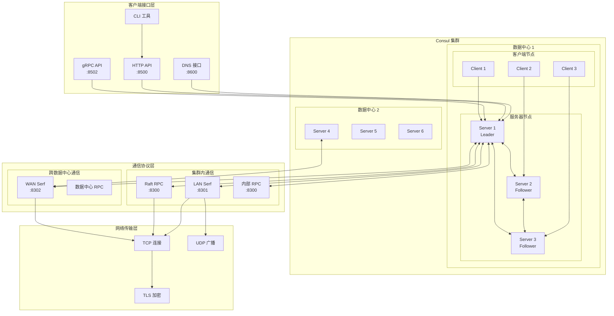
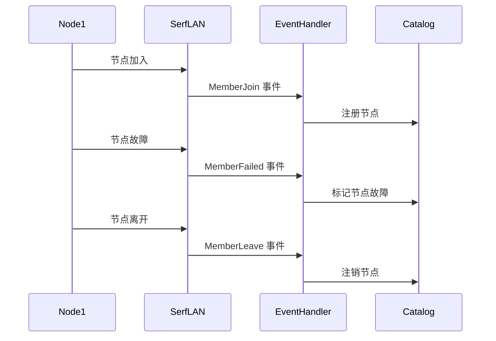
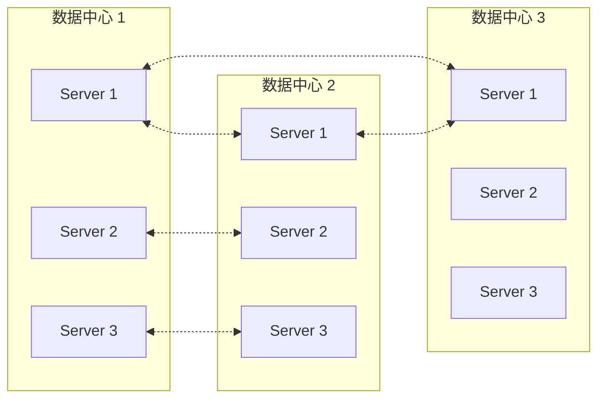
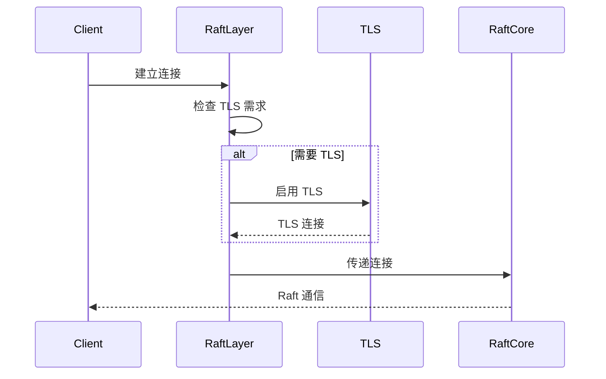
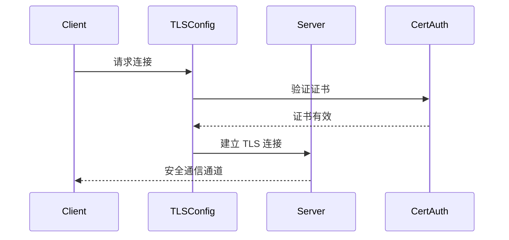
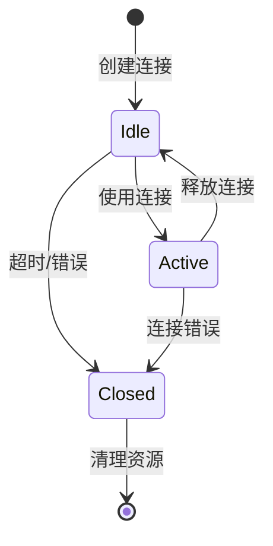

# Consul 网络架构

## 概述

Consul 的网络架构基于多层通信协议，支持服务发现、集群管理、跨数据中心通信等功能。核心组件包括 Serf 集群管理、多种 API 接口、以及安全的 TLS 通信。

## 网络架构总览



## 1. Serf 集群管理

### 1.1 LAN Serf - 数据中心内通信

#### 核心功能
- **位置**: `agent/consul/server.go:344-353`
- **端口**: 默认 8301
- **协议**: TCP + UDP
- **范围**: 单个数据中心内的所有节点

```go
// LAN Serf 配置
type Server struct {
    // serfLAN 是数据中心内维护的 Serf 集群
    // 包含 DC 内的所有节点
    serfLAN *serf.Serf
    
    // eventChLAN 用于接收来自数据中心内
    // serf 集群的事件
    eventChLAN chan serf.Event
}
```

#### 主要职责
1. **成员发现**: 自动发现数据中心内的新节点
2. **故障检测**: 检测节点故障和恢复
3. **事件传播**: 传播用户自定义事件
4. **元数据同步**: 同步节点元数据信息

#### 事件处理流程


### 1.2 WAN Serf - 跨数据中心通信

#### 核心功能
- **位置**: `agent/consul/server.go:355-360`
- **端口**: 默认 8302
- **协议**: TCP + UDP
- **范围**: 跨数据中心的服务器节点

```go
type Server struct {
    // serfWAN 是跨数据中心维护的 Serf 集群
    // 应该只包含 Consul 服务器
    serfWAN                *serf.Serf
    serfWANConfig          *serf.Config
    memberlistTransportWAN wanfed.IngestionAwareTransport
    gatewayLocator         *GatewayLocator
}
```

#### 联邦机制


## 2. RPC 通信架构

### 2.1 内部 RPC 系统

#### 核心组件
- **位置**: `agent/consul/server.go:220-225`
- **端口**: 默认 8300
- **协议**: TCP (支持 TLS)

```go
type Server struct {
    // 到其他 consul 服务器的连接池
    connPool *pool.ConnPool
    
    // 使用 gRPC 到其他 consul 服务器的连接池
    grpcConnPool GRPCClientConner
}
```

#### RPC 端点注册
```go
// 位置: agent/consul/server.go:1190-1200
type factory func(s *Server) interface{}

var endpoints []factory

func registerEndpoint(fn factory) {
    endpoints = append(endpoints, fn)
}
```

### 2.2 Raft RPC 层

#### 实现细节
- **位置**: `agent/consul/raft_rpc.go`
- **功能**: Raft 协议专用的网络层

```go
// RaftLayer 实现 raft.StreamLayer 接口
// 使得我们可以为 Raft 和 Consul 使用单一的 RPC 层
type RaftLayer struct {
    src     net.Addr          // 出站连接地址
    addr    net.Addr          // 监听器地址
    connCh  chan net.Conn     // 接受连接的通道
    tlsWrap tlsutil.Wrapper   // TLS 包装器
    tlsFunc func(raft.ServerAddress) bool
}
```

#### 连接处理流程


## 3. API 接口层

### 3.1 HTTP API

#### 核心实现
- **位置**: `agent/http.go`
- **端口**: 默认 8500
- **协议**: HTTP/HTTPS

```go
// HTTP 服务器配置
func (s *HTTPHandlers) handler() http.Handler {
    mux := http.NewServeMux()
    
    // 注册各种端点
    mux.HandleFunc("/v1/catalog/", s.wrap(s.CatalogEndpoint))
    mux.HandleFunc("/v1/health/", s.wrap(s.HealthEndpoint))
    mux.HandleFunc("/v1/kv/", s.wrap(s.KVSEndpoint))
    // ... 更多端点
    
    return mux
}
```

#### 主要端点
- `/v1/catalog/` - 服务目录操作
- `/v1/health/` - 健康检查
- `/v1/kv/` - 键值存储
- `/v1/agent/` - 代理操作
- `/v1/session/` - 会话管理
- `/v1/acl/` - 访问控制

### 3.2 gRPC API

#### 服务注册
- **位置**: `agent/consul/server_grpc.go`
- **端口**: 默认 8502
- **协议**: gRPC (HTTP/2)

```go
// gRPC 服务设置
func (s *Server) setupGRPCServices(config *Config, deps Deps) error {
    // 注册资源服务
    err := s.registerResourceServiceServer(
        deps.Registry,
        s.ACLResolver,
        s.secureSafeGRPCChan,
        s.externalGRPCServer,
    )
    
    // 注册其他服务...
    return err
}
```

#### 支持的服务
- ResourceService - 资源管理
- ConnectCAService - 证书颁发机构
- DataplaneService - 数据平面配置
- PeeringService - 集群对等

### 3.3 DNS 接口

#### 实现架构
- **位置**: `agent/dns.go`
- **端口**: 默认 8600
- **协议**: DNS (UDP/TCP)

```go
// DNS 查询处理
func (d *DNSServer) handleQuery(resp dns.ResponseWriter, req *dns.Msg) {
    q := req.Question[0]
    defer func(start time.Time) {
        d.logger.Debug("request served from client",
            "question", q,
            "latency", time.Since(start),
        )
    }(time.Now())
    
    // 路由到相应的处理器
    switch {
    case strings.HasSuffix(qName, ".node."+domain):
        d.nodeQuery(cfg, datacenter, req, resp)
    case strings.HasSuffix(qName, ".service."+domain):
        d.serviceQuery(cfg, datacenter, req, resp)
    // ... 其他查询类型
    }
}
```

#### DNS 记录类型
- **A/AAAA**: 服务和节点的 IP 地址
- **SRV**: 服务记录，包含端口信息
- **CNAME**: 别名记录
- **PTR**: 反向 DNS 查询

## 4. 网络安全

### 4.1 TLS 配置

#### 核心组件
- **位置**: `tlsutil/config.go`
- **功能**: 统一的 TLS 配置管理

```go
type Configurator struct {
    // TLS 配置
    cert           *tls.Certificate
    ca             *x509.Certificate
    caPool         *x509.CertPool
    
    // 配置选项
    verifyIncoming       bool
    verifyOutgoing       bool
    verifyServerHostname bool
}
```

#### 加密通信流程


### 4.2 ACL 集成

#### 网络层 ACL 检查
```go
// HTTP 请求 ACL 验证
func (s *HTTPHandlers) parseToken(req *http.Request, token *string) {
    // 从 Header 或 Query 参数获取令牌
    if tok := req.Header.Get("X-Consul-Token"); tok != "" {
        *token = tok
    } else if tok := req.URL.Query().Get("token"); tok != "" {
        *token = tok
    }
}
```

## 5. 连接池管理

### 5.1 RPC 连接池

#### 实现细节
- **位置**: `agent/pool/pool.go`
- **功能**: 管理到其他 Consul 节点的连接

```go
type ConnPool struct {
    // 连接池配置
    maxTime time.Duration
    maxStreams int
    
    // 连接管理
    pool map[string]*Conn
    lock sync.Mutex
}
```

### 5.2 连接复用策略

#### 连接生命周期


## 6. 负载均衡和路由

### 6.1 服务器路由

#### 路由器实现
- **位置**: `agent/router/router.go`
- **功能**: 智能路由到最佳服务器

```go
type Router struct {
    // 区域管理
    areas map[types.AreaID]*areaInfo
    
    // 路由策略
    routeFn func(*areaInfo) *Manager
}
```

### 6.2 健康检查集成

#### 路由决策因素
- 服务器健康状态
- 网络延迟
- 负载情况
- 地理位置

## 7. 监控和调试

### 7.1 网络指标

#### 关键指标
- 连接数量和状态
- RPC 请求延迟
- Serf 事件频率
- DNS 查询性能

### 7.2 调试工具

#### 网络诊断
```bash
# 查看集群成员
consul members

# 检查 Serf 状态
consul monitor

# 网络连接测试
consul rtt <node>
```

这个网络架构确保了 Consul 集群的高可用性、可扩展性和安全性，为分布式服务提供了可靠的网络基础设施。
