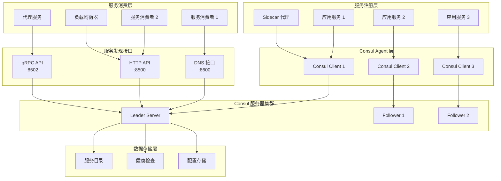
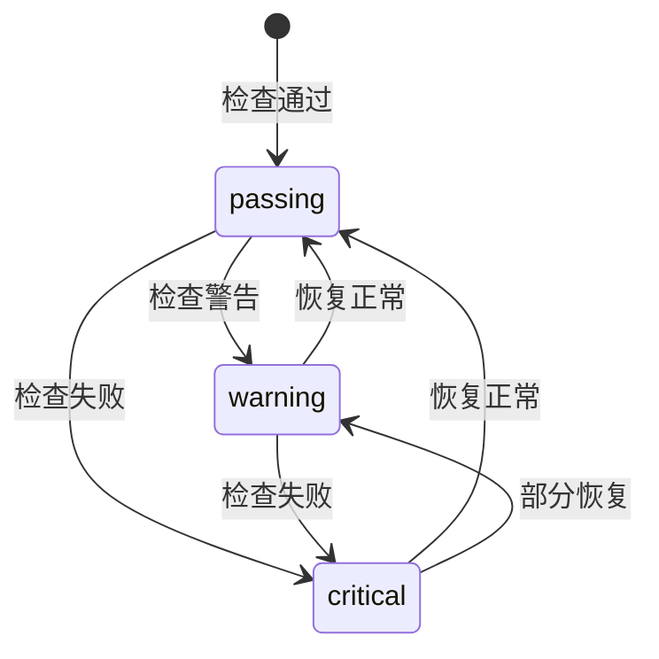
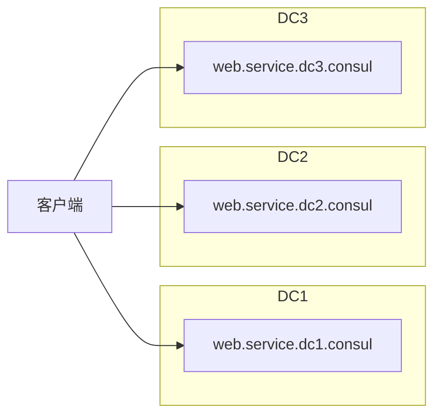

# Consul 服务发现架构

## 概述

Consul 的服务发现架构提供了多种接口和机制来注册、发现和监控服务。它支持 DNS、HTTP API、健康检查、以及实时的服务状态更新，为微服务架构提供了完整的服务发现解决方案。

## 服务发现架构总览



## 1. 服务注册机制

### 1.1 服务注册流程

#### 核心实现
- **位置**: `agent/consul/catalog_endpoint.go:107-121`
- **端点**: `Catalog.Register`

```go
// 注册服务和/或检查到节点，如果节点不存在则创建
func (c *Catalog) Register(args *structs.RegisterRequest, reply *struct{}) error {
    if done, err := c.srv.ForwardRPC("Catalog.Register", args, reply); done {
        return err
    }
    defer metrics.MeasureSince([]string{"catalog", "register"}, time.Now())
    
    // 获取 ACL 令牌
    authz, err := c.srv.ResolveTokenAndDefaultMeta(args.Token, &args.EnterpriseMeta, nil)
    if err != nil {
        return err
    }
    
    // 验证和处理注册请求...
}
```

#### 注册请求结构
```go
type RegisterRequest struct {
    Datacenter      string
    ID              types.NodeID
    Node            string
    Address         string
    TaggedAddresses map[string]string
    NodeMeta        map[string]string
    Service         *NodeService
    Check           *HealthCheck
    Checks          HealthChecks
    
    // 企业版字段
    EnterpriseMeta
}
```

### 1.2 服务定义

#### NodeService 结构
```go
type NodeService struct {
    Kind              ServiceKind
    ID                string
    Service           string
    Tags              []string
    Address           string
    TaggedAddresses   map[string]ServiceAddress
    Meta              map[string]string
    Port              int
    Weights           *Weights
    EnableTagOverride bool
    
    // Connect 相关
    Connect *ServiceConnect
    Proxy   *ConnectProxyConfig
}
```

#### 服务注册示例
```json
{
  "Node": "web-server-01",
  "Address": "192.168.1.100",
  "Service": {
    "ID": "web-01",
    "Service": "web",
    "Tags": ["v1", "primary"],
    "Address": "192.168.1.100",
    "Port": 8080,
    "Meta": {
      "version": "1.0.0",
      "environment": "production"
    }
  },
  "Check": {
    "HTTP": "http://192.168.1.100:8080/health",
    "Interval": "10s"
  }
}
```

## 2. DNS 服务发现

### 2.1 DNS 查询处理

#### 核心实现
- **位置**: `agent/dns.go`
- **端口**: 默认 8600

```go
// DNS 查询处理主函数
func (d *DNSServer) handleQuery(resp dns.ResponseWriter, req *dns.Msg) {
    q := req.Question[0]
    qName := strings.ToLower(dns.Fqdn(q.Name))
    qType := q.Qtype
    
    // 根据查询类型路由
    switch {
    case strings.HasSuffix(qName, ".node."+domain):
        d.nodeQuery(cfg, datacenter, req, resp)
    case strings.HasSuffix(qName, ".service."+domain):
        d.serviceQuery(cfg, datacenter, req, resp)
    case strings.HasSuffix(qName, ".query."+domain):
        d.preparedQuery(cfg, datacenter, req, resp)
    }
}
```

### 2.2 DNS 记录类型

#### 服务查询格式
```
[tag.]<service>.service[.datacenter].<domain>
```

#### 查询示例
```bash
# 查询 web 服务的所有实例
dig @127.0.0.1 -p 8600 web.service.consul

# 查询带标签的服务实例
dig @127.0.0.1 -p 8600 primary.web.service.consul

# SRV 记录查询（包含端口信息）
dig @127.0.0.1 -p 8600 web.service.consul SRV

# 跨数据中心查询
dig @127.0.0.1 -p 8600 web.service.dc2.consul
```

### 2.3 DNS 响应处理

#### A/AAAA 记录
```go
// 位置: agent/dns.go:1850-1857
func (d *DNSServer) makeARecord(qType uint16, ip net.IP, ttl time.Duration) dns.RR {
    if ip.To4() != nil && qType == dns.TypeA {
        return &dns.A{
            Hdr: dns.RR_Header{Name: qName, Rrtype: dns.TypeA, Class: dns.ClassINET, Ttl: uint32(ttl/time.Second)},
            A:   ip.To4(),
        }
    }
    // IPv6 处理...
}
```

#### SRV 记录
```go
// SRV 记录包含服务的端口和权重信息
type SRV struct {
    Hdr      RR_Header
    Priority uint16
    Weight   uint16
    Port     uint16
    Target   string
}
```

## 3. HTTP API 服务发现

### 3.1 目录 API

#### 服务列表查询
- **端点**: `GET /v1/catalog/services`
- **功能**: 获取所有注册的服务

```go
// 位置: agent/catalog_endpoint.go
func (s *HTTPHandlers) CatalogServices(resp http.ResponseWriter, req *http.Request) (interface{}, error) {
    args := structs.DCSpecificRequest{}
    if done := s.parse(resp, req, &args.Datacenter, &args.QueryOptions); done {
        return nil, nil
    }
    
    var out structs.IndexedServices
    defer setMeta(resp, &out.QueryMeta)
    if err := s.agent.RPC(req.Context(), "Catalog.ListServices", &args, &out); err != nil {
        return nil, err
    }
    
    return out.Services, nil
}
```

#### 服务实例查询
- **端点**: `GET /v1/catalog/service/<service>`
- **功能**: 获取特定服务的所有实例

```json
[
  {
    "ID": "web-01",
    "Node": "web-server-01",
    "Address": "192.168.1.100",
    "Datacenter": "dc1",
    "TaggedAddresses": {
      "lan": "192.168.1.100",
      "wan": "203.0.113.100"
    },
    "NodeMeta": {},
    "ServiceID": "web-01",
    "ServiceName": "web",
    "ServiceTags": ["v1", "primary"],
    "ServiceAddress": "192.168.1.100",
    "ServicePort": 8080,
    "ServiceMeta": {
      "version": "1.0.0"
    }
  }
]
```

### 3.2 健康 API

#### 健康服务查询
- **端点**: `GET /v1/health/service/<service>`
- **功能**: 获取健康的服务实例

```go
// 位置: agent/health_endpoint.go
func (s *HTTPHandlers) HealthServiceNodes(resp http.ResponseWriter, req *http.Request) (interface{}, error) {
    args := structs.ServiceSpecificRequest{}
    // 解析查询参数...
    
    var out structs.IndexedCheckServiceNodes
    defer setMeta(resp, &out.QueryMeta)
    if err := s.agent.RPC(req.Context(), "Health.ServiceNodes", &args, &out); err != nil {
        return nil, err
    }
    
    // 过滤不健康的节点
    return filterNonPassing(args.Filter, out.Nodes), nil
}
```

## 4. 健康检查机制

### 4.1 健康检查类型

#### HTTP 检查
```json
{
  "HTTP": "http://localhost:8080/health",
  "Interval": "10s",
  "Timeout": "3s"
}
```

#### TCP 检查
```json
{
  "TCP": "localhost:8080",
  "Interval": "10s",
  "Timeout": "3s"
}
```

#### 脚本检查
```json
{
  "Script": "/usr/local/bin/check_service.sh",
  "Interval": "30s"
}
```

#### TTL 检查
```json
{
  "TTL": "30s",
  "Notes": "Service heartbeat check"
}
```

### 4.2 健康检查状态

#### 状态类型
- **passing**: 检查通过
- **warning**: 警告状态
- **critical**: 检查失败

#### 状态转换


### 4.3 健康检查实现

#### 检查执行器
- **位置**: `agent/checks/check.go`

```go
type CheckRunner interface {
    Start()
    Stop()
    UpdateCheck(check types.CheckType, status api.HealthStatus, output string)
}

// HTTP 检查实现
type CheckHTTP struct {
    CheckID     types.CheckID
    HTTP        string
    Header      map[string][]string
    Method      string
    Body        string
    Interval    time.Duration
    Timeout     time.Duration
    Logger      hclog.Logger
}
```

## 5. 服务发现优化

### 5.1 缓存机制

#### 客户端缓存
- **位置**: `agent/cache/cache.go`
- **功能**: 缓存服务发现结果，减少服务器负载

```go
type Cache struct {
    // 缓存条目
    entries map[string]cacheEntry
    
    // 缓存策略
    types map[string]Type
    
    // 监控和指标
    requests  uint64
    hits      uint64
}
```

#### 缓存策略
- **TTL**: 基于时间的过期
- **Refresh**: 后台刷新
- **Watch**: 实时更新

### 5.2 负载均衡

#### 服务实例选择
```go
// 随机打乱服务实例顺序
func (nodes CheckServiceNodes) Shuffle() {
    for i := len(nodes) - 1; i > 0; i-- {
        j := rand.Intn(i + 1)
        nodes[i], nodes[j] = nodes[j], nodes[i]
    }
}
```

#### 权重支持
```go
type Weights struct {
    Passing int
    Warning int
}
```

## 6. 跨数据中心服务发现

### 6.1 数据中心路由

#### 查询路由
```go
// 位置: agent/consul/catalog_endpoint.go
func (c *Catalog) ServiceNodes(args *structs.ServiceSpecificRequest, reply *structs.IndexedServiceNodes) error {
    if args.Datacenter != c.srv.config.Datacenter {
        // 转发到目标数据中心
        return c.srv.forwardDC("Catalog.ServiceNodes", args.Datacenter, args, reply)
    }
    // 本地处理...
}
```

### 6.2 联邦服务发现

#### WAN 联邦


## 7. 服务网格集成

### 7.1 Connect 服务发现

#### Connect 原生服务
```json
{
  "Service": {
    "Name": "web",
    "Port": 8080,
    "Connect": {
      "Native": true
    }
  }
}
```

#### Sidecar 代理服务
```json
{
  "Service": {
    "Name": "web-sidecar-proxy",
    "Kind": "connect-proxy",
    "Proxy": {
      "DestinationServiceName": "web",
      "DestinationServiceID": "web-01"
    },
    "Port": 21000
  }
}
```

### 7.2 意图和授权

#### 服务意图
```json
{
  "SourceName": "frontend",
  "DestinationName": "backend",
  "Action": "allow"
}
```

## 8. 监控和调试

### 8.1 服务发现指标

#### 关键指标
- 服务注册/注销频率
- DNS 查询延迟
- 健康检查成功率
- 缓存命中率

### 8.2 调试工具

#### CLI 命令
```bash
# 查看服务列表
consul catalog services

# 查看服务实例
consul catalog nodes -service=web

# 查看健康检查
consul monitor

# DNS 测试
dig @127.0.0.1 -p 8600 web.service.consul
```

这个服务发现架构为微服务提供了完整的服务注册、发现、健康检查和负载均衡解决方案，支持多种接口和跨数据中心部署。
