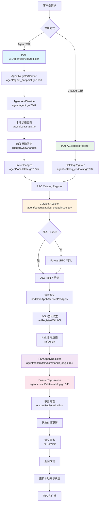

# Consul 服务注册架构详解

## 概述

本文档详细分析 Consul 服务注册的完整架构和实现流程，包括两种主要的注册方式：Agent 服务注册和 Catalog 直接注册。

## 架构组件

### 1. HTTP 处理层
- **位置**: `agent/http_register.go`, `agent/agent_endpoint.go`, `agent/catalog_endpoint.go`
- **职责**: 处理 HTTP 请求，解析参数，验证输入

### 2. Agent 本地状态管理
- **位置**: `agent/agent.go`, `agent/local/state.go`
- **职责**: 管理本地服务状态，触发反熵同步

### 3. RPC 通信层
- **位置**: `agent/consul/catalog_endpoint.go`
- **职责**: 处理集群内 RPC 调用，Leader 转发

### 4. FSM 状态机
- **位置**: `agent/consul/fsm/commands_ce.go`
- **职责**: 处理 Raft 日志应用，状态转换

### 5. 状态存储层
- **位置**: `agent/consul/state/catalog.go`
- **职责**: 数据持久化，事务处理

## 服务注册流程

### Agent 服务注册 (`/v1/agent/service/register`)

#### 1. HTTP 请求处理
```go
// agent/agent_endpoint.go:1150
func (s *HTTPHandlers) AgentRegisterService(resp http.ResponseWriter, req *http.Request) (interface{}, error) {
    var args structs.ServiceDefinition
    // 解析企业元数据
    if err := s.parseEntMetaNoWildcard(req, &args.EnterpriseMeta); err != nil {
        return nil, err
    }
    // 解析请求体
    if err := decodeBody(req.Body, &args); err != nil {
        return nil, HTTPError{StatusCode: http.StatusBadRequest, Reason: fmt.Sprintf("Request decode failed: %v", err)}
    }
    // 验证服务名称
    if args.Name == "" {
        return nil, HTTPError{StatusCode: http.StatusBadRequest, Reason: "Missing service name"}
    }
}
```

#### 2. Agent 服务添加
```go
// agent/agent.go:2347
func (a *Agent) AddService(req AddServiceRequest) error {
    a.stateLock.Lock()
    defer a.stateLock.Unlock()
    
    rl := addServiceLockedRequest{
        AddServiceRequest:    req,
        serviceDefaults:      serviceDefaultsFromCache(a.baseDeps, req),
        persistServiceConfig: true,
    }
    return a.addServiceLocked(rl)
}
```

#### 3. 本地状态更新
```go
// agent/local/state.go
func (l *State) AddServiceWithChecks(service *structs.NodeService, checks []*structs.HealthCheck, token string, locallyRegistered bool) error {
    // 添加服务到本地状态
    // 标记为未同步状态
    service.InSync = false
}
```

#### 4. 反熵同步触发
```go
// agent/local/state.go:1245
func (l *State) SyncChanges() error {
    l.Lock()
    defer l.Unlock()
    
    // 同步节点信息
    if !l.nodeInfoInSync {
        if err := l.syncNodeInfo(); err != nil {
            return err
        }
    }
    // 同步服务和检查
}
```

### Catalog 直接注册 (`/v1/catalog/register`)

#### 1. HTTP 请求处理
```go
// agent/catalog_endpoint.go:134
func (s *HTTPHandlers) CatalogRegister(resp http.ResponseWriter, req *http.Request) (interface{}, error) {
    var args structs.RegisterRequest
    // 解析企业元数据
    if err := s.parseEntMetaNoWildcard(req, &args.EnterpriseMeta); err != nil {
        return nil, err
    }
    // 解析请求体
    if err := s.rewordUnknownEnterpriseFieldError(decodeBody(req.Body, &args)); err != nil {
        return nil, HTTPError{StatusCode: http.StatusBadRequest, Reason: fmt.Sprintf("Request decode failed: %v", err)}
    }
    // 设置默认数据中心
    if args.Datacenter == "" {
        args.Datacenter = s.agent.config.Datacenter
    }
    // 解析 Token
    s.parseToken(req, &args.Token)
    
    // 转发到服务器
    var out struct{}
    if err := s.agent.RPC(req.Context(), "Catalog.Register", &args, &out); err != nil {
        return nil, err
    }
    return true, nil
}
```

### Catalog RPC 处理

#### 1. 注册请求处理
```go
// agent/consul/catalog_endpoint.go:107
func (c *Catalog) Register(args *structs.RegisterRequest, reply *struct{}) error {
    // Leader 转发
    if done, err := c.srv.ForwardRPC("Catalog.Register", args, reply); done {
        return err
    }
    
    // ACL Token 解析
    authz, err := c.srv.ResolveTokenAndDefaultMeta(args.Token, &args.EnterpriseMeta, nil)
    if err != nil {
        return err
    }
    
    // 验证请求
    state := c.srv.fsm.State()
    entMeta, err := state.ValidateRegisterRequest(args)
    if err != nil {
        return err
    }
    
    // 节点验证
    if err := nodePreApply(args.Node, string(args.ID)); err != nil {
        return err
    }
    
    // 服务验证
    if args.Service != nil {
        if err := servicePreApply(args.Service, authz, args.Service.FillAuthzContext); err != nil {
            return err
        }
    }
    
    // ACL 权限检查
    _, ns, err := state.NodeServices(nil, args.Node, entMeta, args.PeerName)
    if err != nil {
        return fmt.Errorf("Node lookup failed: %v", err)
    }
    if err := vetRegisterWithACL(authz, args, ns); err != nil {
        return err
    }
    
    // 应用到 Raft
    _, err = c.srv.raftApply(structs.RegisterRequestType, args)
    return err
}
```

#### 2. FSM 状态机处理
```go
// agent/consul/fsm/commands_ce.go:153
func (c *FSM) applyRegister(buf []byte, index uint64) interface{} {
    defer metrics.MeasureSince([]string{"fsm", "register"}, time.Now())
    var req structs.RegisterRequest
    if err := decodeRegistrationReq(buf, &req); err != nil {
        if errors.Is(err, ErrDroppingTenantedReq) {
            c.logger.Warn("dropping tenanted register request")
            return nil
        }
        panic(fmt.Errorf("failed to decode request: %v", err))
    }
    
    // 在单个事务中应用所有更新
    if err := c.state.EnsureRegistration(index, &req); err != nil {
        c.logger.Warn("EnsureRegistration failed", "error", err)
        return err
    }
    return nil
}
```

#### 3. 状态存储处理
```go
// agent/consul/state/catalog.go:143
func (s *Store) EnsureRegistration(idx uint64, req *structs.RegisterRequest) error {
    tx := s.db.WriteTxn(idx)
    defer tx.Abort()
    
    if err := s.ensureRegistrationTxn(tx, idx, false, req, false); err != nil {
        return err
    }
    
    return tx.Commit()
}
```

## 关键数据结构

### RegisterRequest
```go
// agent/structs/structs.go:481
type RegisterRequest struct {
    Datacenter      string
    ID              types.NodeID
    Node            string
    Address         string
    TaggedAddresses map[string]string
    NodeMeta        map[string]string
    Service         *NodeService
    Check           *HealthCheck
    Checks          HealthChecks
    Locality        *Locality
    SkipNodeUpdate  bool
    PeerName        string
    acl.EnterpriseMeta
    WriteRequest
    RaftIndex
}
```

### ServiceDefinition
```go
// agent/structs/structs.go
type ServiceDefinition struct {
    Kind              ServiceKind
    ID                string
    Name              string
    Tags              []string
    Address           string
    TaggedAddresses   map[string]ServiceAddress
    Meta              map[string]string
    Port              int
    Check             CheckType
    Checks            CheckTypes
    Weights           *Weights
    Token             string
    EnableTagOverride bool
    Proxy             *ConnectProxyConfig
    Connect           *ServiceConnect
    Locality          *Locality
    acl.EnterpriseMeta
}
```

## 反熵同步机制

### 同步触发
- **位置**: `agent/ae/ae.go`, `agent/local/state.go`
- **机制**: 定期同步 + 变更触发同步
- **目的**: 确保本地状态与集群状态一致

### 同步流程
1. **状态比较**: 比较本地状态与远程状态
2. **差异识别**: 识别需要同步的服务和检查
3. **批量同步**: 批量提交变更到集群
4. **状态更新**: 更新本地同步状态

## 错误处理

### HTTP 层错误
- 400 Bad Request: 请求格式错误、缺少必需字段
- 403 Forbidden: ACL 权限不足
- 500 Internal Server Error: 内部处理错误

### RPC 层错误
- Leader 转发失败
- ACL Token 验证失败
- 服务验证失败
- Raft 应用失败

### 状态存储错误
- 事务冲突
- 数据约束违反
- 存储引擎错误

## 性能考虑

### 批量操作
- 支持单次请求注册多个检查
- 事务性处理确保一致性

### 缓存机制
- 本地状态缓存
- ACL 权限缓存
- 服务发现结果缓存

### 异步处理
- 反熵同步异步执行
- 不阻塞客户端请求

## 监控指标

### HTTP 指标
- `client.api.catalog_register`: Catalog 注册请求计数
- `client.api.success.catalog_register`: 成功注册计数
- `client.rpc.error.catalog_register`: RPC 错误计数

### Catalog 指标
- `catalog.register`: 注册处理时间
- `fsm.register`: FSM 处理时间

### 反熵指标
- 同步频率和延迟
- 同步失败计数
- 状态差异统计

## 服务注册流程图



## 代码位置索引

### HTTP 端点注册
- `agent/http_register.go:59` - Agent 服务注册端点
- `agent/http_register.go:62` - Catalog 注册端点

### HTTP 处理器
- `agent/agent_endpoint.go:1150` - AgentRegisterService 处理器
- `agent/catalog_endpoint.go:134` - CatalogRegister 处理器

### Agent 服务管理
- `agent/agent.go:2347` - AddService 方法
- `agent/agent.go:2361` - addServiceLocked 方法
- `agent/agent.go:2534` - addServiceInternal 方法

### 本地状态管理
- `agent/local/state.go:168` - State 结构定义
- `agent/local/state.go:1245` - SyncChanges 方法
- `agent/local/state.go:1227` - SyncFull 方法

### RPC 处理
- `agent/consul/catalog_endpoint.go:107` - Catalog.Register RPC 方法

### FSM 状态机
- `agent/consul/fsm/commands_ce.go:153` - applyRegister 方法

### 状态存储
- `agent/consul/state/catalog.go:143` - EnsureRegistration 方法
- `agent/consul/state/catalog.go:122` - Registration 恢复方法

### 数据结构
- `agent/structs/structs.go:481` - RegisterRequest 结构
- `agent/structs/structs.go:50` - RegisterRequestType 常量

### 反熵同步
- `agent/ae/ae.go:57` - StateSyncer 结构
- `agent/agent.go:1972` - StartSync 方法
