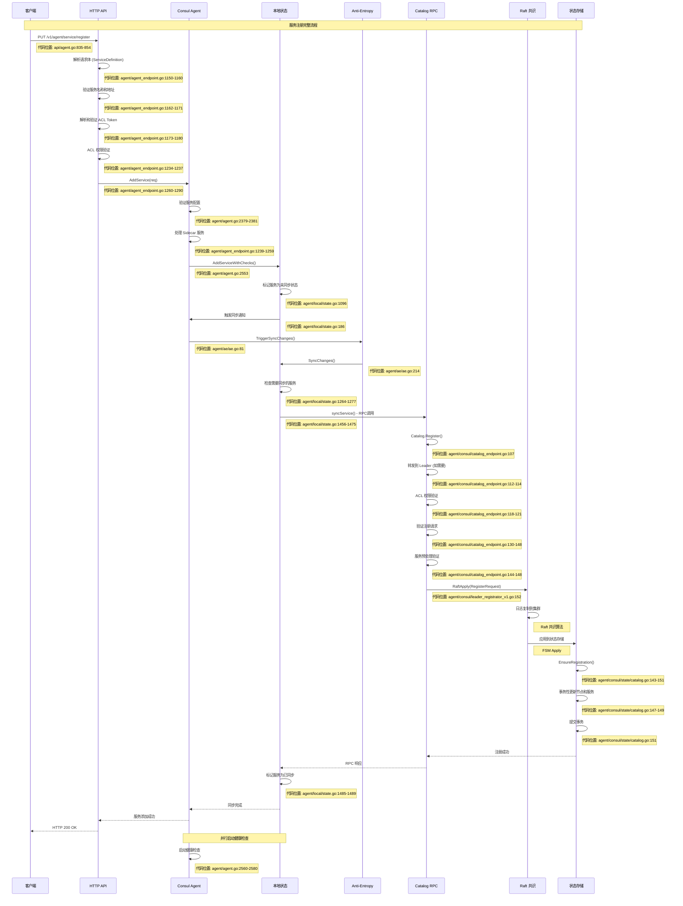

# Consul 服务注册时序图分析

## 概述

本文档详细分析了 Consul 服务注册的完整流程，从客户端发起注册请求到最终在集群中同步完成的整个时序过程，并标记了相关代码的具体位置。

## 服务注册时序图



## 关键代码位置详解

### 1. HTTP API 层 (`agent/agent_endpoint.go`)

**AgentRegisterService 方法** (行 1150-1290)
- 处理 `/v1/agent/service/register` 端点
- 解析 JSON 请求体为 `structs.ServiceDefinition`
- 验证服务名称、地址等基本参数
- 执行 ACL 权限检查

### 2. Agent 服务管理 (`agent/agent.go`)

**AddService 方法** (行 2347-2356)
- 服务注册的主入口点
- 加锁保护并发访问
- 调用 `addServiceLocked` 进行实际处理

**addServiceInternal 方法** (行 2534-2580)
- 执行服务验证和预处理
- 调用本地状态管理器添加服务
- 启动相关的健康检查

### 3. 本地状态管理 (`agent/local/state.go`)

**State 结构体** (行 169-200)
- 管理节点的服务和检查状态
- 实现 anti-entropy 机制
- 维护本地与远程状态的同步

**SyncChanges 方法** (行 1245-1300)
- 推送未同步的服务到服务器
- 处理服务的增删改操作
- 错误处理和重试机制

**syncService 方法** (行 1456-1514)
- 构造 `RegisterRequest` 结构
- 通过 RPC 调用 `Catalog.Register`
- 处理 ACL 权限错误

### 4. Catalog RPC 端点 (`agent/consul/catalog_endpoint.go`)

**Register 方法** (行 107-180)
- 处理服务注册的 RPC 请求
- 执行请求转发（如果不是 Leader）
- 验证 ACL 权限和企业版元数据
- 调用 Raft Apply 进行状态更新

### 5. 状态存储 (`agent/consul/state/catalog.go`)

**EnsureRegistration 方法** (行 143-151)
- 在单个事务中完成节点、服务、检查的注册
- 避免状态更新的竞态条件
- 提供原子性保证

## Anti-Entropy 同步机制

### 同步触发器 (`agent/ae/ae.go`)

**StateSyncer** (行 57-90)
- 管理后台状态同步
- 提供定期和按需同步
- 实现自愈机制（anti-entropy）

**状态机运行** (行 155-230)
- `fullSyncState`: 完整同步状态
- `partialSyncState`: 部分同步状态
- 根据事件类型转换状态

## 服务注册流程总结

1. **HTTP 请求处理**: 客户端通过 HTTP API 发起服务注册
2. **参数验证**: 验证服务定义和 ACL 权限
3. **本地状态更新**: 将服务添加到 Agent 本地状态
4. **Anti-Entropy 触发**: 触发状态同步机制
5. **RPC 调用**: 通过 Catalog RPC 向集群注册服务
6. **Raft 共识**: 通过 Raft 算法在集群中达成共识
7. **状态存储**: 将服务信息持久化到状态存储
8. **同步完成**: 标记本地状态为已同步

这个流程确保了服务注册的一致性、可靠性和高可用性。

## 代码位置快速索引

### HTTP API 层
- **服务注册端点**: `agent/agent_endpoint.go:1150` - `AgentRegisterService`
- **请求解析**: `agent/agent_endpoint.go:1158` - `decodeBody`
- **服务验证**: `agent/agent_endpoint.go:1162-1171` - 名称和地址验证
- **ACL 验证**: `agent/agent_endpoint.go:1234-1237` - `vetServiceRegisterWithAuthorizer`

### Agent 核心逻辑
- **服务添加**: `agent/agent.go:2347` - `AddService`
- **状态锁管理**: `agent/agent.go:2348-2349` - `stateLock.Lock()`
- **服务验证**: `agent/agent.go:2379-2381` - `validateService`
- **本地状态更新**: `agent/agent.go:2553` - `AddServiceWithChecks`

### 本地状态管理
- **状态结构**: `agent/local/state.go:169-200` - `State` 结构体
- **同步触发**: `agent/local/state.go:186` - `TriggerSyncChanges`
- **状态同步**: `agent/local/state.go:1245-1300` - `SyncChanges`
- **服务同步**: `agent/local/state.go:1456-1514` - `syncService`

### Anti-Entropy 机制
- **状态同步器**: `agent/ae/ae.go:57-90` - `StateSyncer`
- **同步触发器**: `agent/ae/ae.go:81` - `SyncChanges`
- **状态机**: `agent/ae/ae.go:155-230` - `Run` 和状态转换

### Catalog RPC
- **注册端点**: `agent/consul/catalog_endpoint.go:107` - `Register`
- **请求转发**: `agent/consul/catalog_endpoint.go:112-114` - `ForwardRPC`
- **ACL 验证**: `agent/consul/catalog_endpoint.go:118-121` - `ResolveTokenAndDefaultMeta`
- **请求验证**: `agent/consul/catalog_endpoint.go:130-148` - 各种预处理验证

### 状态存储
- **注册事务**: `agent/consul/state/catalog.go:143-151` - `EnsureRegistration`
- **事务处理**: `agent/consul/state/catalog.go:147-149` - `ensureRegistrationTxn`

### 客户端 API
- **Go 客户端**: `api/agent.go:835-854` - `serviceRegister`
- **HTTP 请求**: `api/agent.go:836-844` - HTTP PUT 请求构造

## 关键数据结构

### 服务定义 (`structs/service.go`)
```go
type ServiceDefinition struct {
    ID                string
    Name              string
    Tags              []string
    Address           string
    Port              int
    Check             *CheckType
    Checks            CheckTypes
    Connect           *ServiceConnect
    EnterpriseMeta    `json:",inline"`
}
```

### 注册请求 (`structs/catalog.go`)
```go
type RegisterRequest struct {
    Datacenter      string
    ID              types.NodeID
    Node            string
    Address         string
    TaggedAddresses map[string]string
    NodeMeta        map[string]string
    Service         *NodeService
    Check           *HealthCheck
    Checks          HealthChecks
    EnterpriseMeta  `json:",inline"`
    WriteRequest
}
```

## 错误处理和重试机制

1. **ACL 权限错误**: 标记为已同步，避免无限重试
2. **网络错误**: 通过 Anti-Entropy 机制自动重试
3. **Raft 错误**: 通过 Leader 转发机制处理
4. **状态冲突**: 通过事务机制保证原子性

## 性能优化要点

1. **批量同步**: Anti-Entropy 支持批量处理多个服务
2. **增量同步**: 只同步变更的服务，避免全量同步
3. **状态缓存**: 本地状态缓存减少 RPC 调用
4. **异步处理**: 服务注册和健康检查启动并行进行
